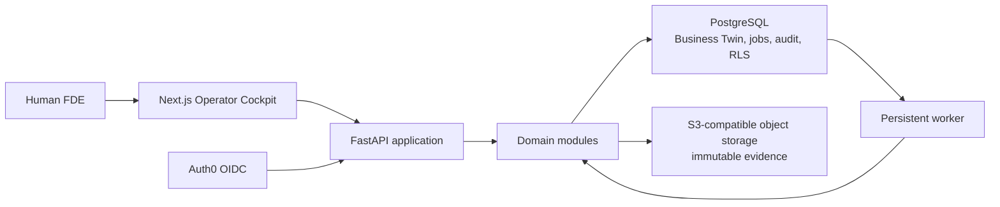

# AI-FDE

AI-FDE is a stateful operating system for Forward Deployed Engineers. It helps one human FDE turn enterprise evidence into a verified model of how a company operates, redesign a workflow, quantify the business case, and produce an implementation-ready specification.

AI-FDE is not a chatbot. Documents are evidence, not truth. The canonical state is an evidence-backed Company Operating Model, or Business Twin, in which every accepted assertion, relationship, rule, exception, and workflow decision retains its provenance and human verification history.

> **Project status: internal alpha.** The repository proves one end-to-end accounts-payable workflow using explicitly synthetic Acme Manufacturing data. It is not approved for customer data or production operation.

## What works today

The Operator Cockpit implements this vertical slice:

```text
Create engagement
  -> ingest immutable text or Markdown evidence
  -> extract candidate claims in a persistent worker job
  -> review exact provenance and accept or reject each claim
  -> construct the verified Company Operating Model
  -> preserve and resolve contradictions with an audited decision
  -> draft and approve the current-state workflow
  -> review Human / Software / AI allocations
  -> design and approve the target-state workflow
  -> calculate and approve a deterministic economic case
  -> generate a dependency-pinned implementation specification
  -> set an explicit retention deadline
  -> export a deterministic, hash-verified portability archive
  -> permanently delete engagement content with a content-free receipt
```

| Area           | Implemented V1 capability                                                                      | Current boundary                                                   |
| -------------- | ---------------------------------------------------------------------------------------------- | ------------------------------------------------------------------ |
| Evidence       | Immutable assets, SHA-256 integrity, addressable segments, persistent ingestion jobs           | `.md` and `.txt` only                                              |
| Extraction     | Candidate claims with exact source provenance and confidence                                   | Deterministic Acme fixture extractor, not production AI extraction |
| Verification   | Human accept/reject decisions, contradictions, uncertainty, freshness, audit events            | Deliberately narrow review operations                              |
| Business Twin  | Verified assertions and relationships queried from structured state                            | Minimal relational Company Operating Model                         |
| Workflows      | Separate, versioned current and target states with approval gates                              | One accounts-payable workflow pattern                              |
| Allocation     | Human / Software / AI recommendations with operator decisions                                  | Bounded deterministic recommendations                              |
| Economics      | Reproducible formulas with measured, calculated, estimated, synthetic, and simulated labels    | Base case only; no sensitivity scenarios yet                       |
| Specifications | Versioned Markdown implementation specification pinned to approved dependencies                | Not yet the complete multi-artifact packet                         |
| Authentication | Development identity locally; Auth0 OIDC with PKCE and opaque, revocable application sessions  | Live Auth0 tenant verification remains open                        |
| Isolation      | Application authorization plus PostgreSQL row-level isolation and cross-engagement tests       | Sanitized customer data remains disabled                           |
| Data lifecycle | Owner-controlled retention, export, permanent deletion, retry state, and content-free receipts | No legal holds or automatic retention enforcement yet              |

## Architecture

AI-FDE is a modular monolith: one deployable product with explicit domain boundaries and a shared PostgreSQL transaction model. This keeps the system maintainable for a single founder while preserving seams that can be extracted later when measured scale requires it.



The approved V1 decisions are:

- Next.js + FastAPI + PostgreSQL modular monolith.
- PostgreSQL relational graph before a separate graph database.
- PostgreSQL-backed persistent jobs and transactional outbox before a workflow platform.
- Application authorization plus PostgreSQL row-level isolation.
- API-managed OIDC with opaque, hash-only application sessions; Auth0 is the first issuer.

See the [architecture decision index](docs/adr/README.md) for the full rationale.

## Trust model

The V1 implementation follows a few non-negotiable rules:

- Evidence may create candidate claims; it cannot directly create verified truth.
- Every material assertion must resolve to an exact evidence segment.
- Human approval is authoritative at every V1 stage gate.
- Contradictions and uncertainty are preserved rather than silently collapsed.
- Approved versions are immutable; upstream changes make dependents stale instead of rewriting history.
- Economic outputs are deterministic, reproducible, and explicit about the origin of every input.
- Retrieved and uploaded content is treated as untrusted input.
- Engagement access is enforced in the application and in PostgreSQL, with non-disclosing failures.
- Demo fixtures, development identity, and deterministic extraction are visibly labeled and cannot be mistaken for production capability.

## Run locally

### Prerequisites

- Docker Desktop
- Python 3.13
- [`uv`](https://docs.astral.sh/uv/)
- Node.js 20.9 or newer
- [`pnpm`](https://pnpm.io/) 10

### Start the stack

```bash
cp .env.example .env
make setup
make infrastructure
make migrate
make seed
make dev
```

`make seed` is idempotent and loads only the synthetic Acme Manufacturing fixture. `make dev` starts the API, persistent worker, and web application together.

| Service           | Local address                                                        |
| ----------------- | -------------------------------------------------------------------- |
| Operator Cockpit  | [http://localhost:3000](http://localhost:3000)                       |
| API health        | [http://localhost:8000/api/health](http://localhost:8000/api/health) |
| API documentation | [http://localhost:8000/docs](http://localhost:8000/docs)             |
| PostgreSQL        | `localhost:55432`                                                    |
| MinIO API         | `localhost:59000`                                                    |
| MinIO console     | [http://localhost:59001](http://localhost:59001)                     |

The default configuration uses a visibly labeled local development identity. It cannot run outside the development environment and cannot access sanitized engagements.

## Walk the golden path

1. Open the Operator Cockpit and select the seeded **Acme Manufacturing** engagement.
2. Wait for the worker to process the two synthetic evidence assets.
3. Review candidate claims alongside their exact source excerpts; accept or reject each claim.
4. Inspect the verified Company Operating Model and resolve its blocking contradiction.
5. Generate, review, and approve the current-state workflow.
6. Review the Human / Software / AI allocation for each workflow step.
7. Generate and approve the target-state workflow.
8. Review the economic inputs, formula, and provenance labels; approve the business case.
9. Generate the versioned implementation specification.
10. As the engagement owner, set retention and download the portability archive. Permanent deletion is available only after the current state has been exported and all confirmation gates pass.

This path is also exercised by the acceptance and isolation test suites.

## Authentication modes

| Mode          | Purpose                               | Configuration                                                                 |
| ------------- | ------------------------------------- | ----------------------------------------------------------------------------- |
| `development` | Local synthetic-data development      | Default values in `.env.example`                                              |
| `oidc`        | Production-oriented operator sessions | Auth0 issuer, client, secret, HTTPS/callback settings, and operator allowlist |

The OIDC flow uses authorization code exchange with PKCE, state and nonce validation, provider-token verification, allowlisted enrollment, and a PostgreSQL-backed opaque application session. Provider tokens are never stored in browser state, and only session digests are persisted.

Follow the [Auth0 operator authentication runbook](docs/runbooks/auth0-operator-authentication.md) before enabling OIDC. A successful contract test is not a substitute for live-tenant verification.

## Data lifecycle

Engagement owners can set an explicit retention deadline, create a deterministic portability export, and permanently delete engagement content. The export contains:

- A manifest with counts, source fingerprint, and archive hash.
- Structured JSON and YAML records.
- Human-readable Markdown documentation and implementation specifications.
- Original evidence files, revalidated against their stored hashes.

Deletion requires a current export, an exact typed engagement name, explicit acknowledgement, and a non-blocking retention state. Database content and object-storage evidence are removed while a content-free deletion receipt remains for operational proof. See the [engagement data lifecycle runbook](docs/runbooks/engagement-data-lifecycle.md).

## Quality gates

```bash
make test        # complete Python test suite
make lint        # Ruff, mypy, ESLint, and TypeScript checks
make acceptance  # golden-path and tenant-isolation suites
pnpm build       # production Next.js build
uv run alembic check
```

Database changes must also pass a clean upgrade, safe downgrade where supported, re-upgrade, and row-isolation verification.

## Repository map

```text
apps/web/                  Next.js Operator Cockpit
apps/api/                  FastAPI entrypoint
apps/worker/               persistent-worker entrypoint
src/ai_fde/modules/        domain-oriented application modules
src/ai_fde/adapters/       database, object-storage, and provider adapters
migrations/                ordered PostgreSQL migrations
fixtures/acme/             explicitly synthetic evidence
tests/acceptance/          complete lifecycle tests
tests/isolation/           authorization and row-policy tests
docs/                      product, architecture, ADRs, plans, and runbooks
```

The application and worker mutate state through the same domain services. Domain modules do not depend on the UI, and customer evidence, credentials, runtime databases, and real exports must never be committed.

## Design-partner readiness

The next release gate is hardening the proven slice, not expanding feature breadth:

1. Validate login, callback, logout, and session revocation against the live Auth0 tenant.
2. Complete the full keyboard and WCAG 2.2 AA pass for the golden path.
3. Verify that normal telemetry contains references rather than raw evidence, secrets, or exported content.
4. Rehearse setup and the complete lifecycle in a clean environment with a new operator.
5. Select the deployment and production extraction providers through explicit architecture decisions.

Sanitized customer data remains blocked until the relevant readiness checklist passes. Coding-agent execution, autonomous remediation, pilot execution, continuous ROI tracking, and higher autonomy levels remain post-V1 work.

## Documentation

Start with the [documentation index](docs/README.md). The primary sources of truth are:

- [Product vision](docs/product/vision.md)
- [V1 product requirements](docs/product/prd.md)
- [System architecture](docs/architecture/system-architecture.md)
- [Domain model](docs/architecture/domain-model.md)
- [Company Operating Model schema](docs/architecture/company-operating-model.md)
- [FDE lifecycle](docs/methodology/fde-lifecycle.md)
- [Implementation roadmap](docs/roadmap/implementation-roadmap.md)
- [Active V1 backlog](docs/backlog/initial-backlog.md)
