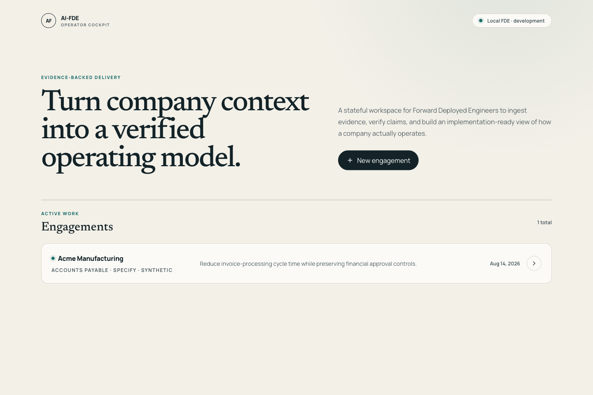
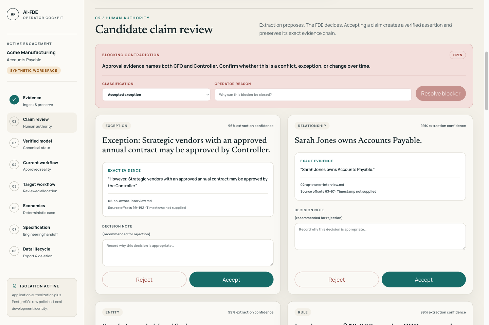
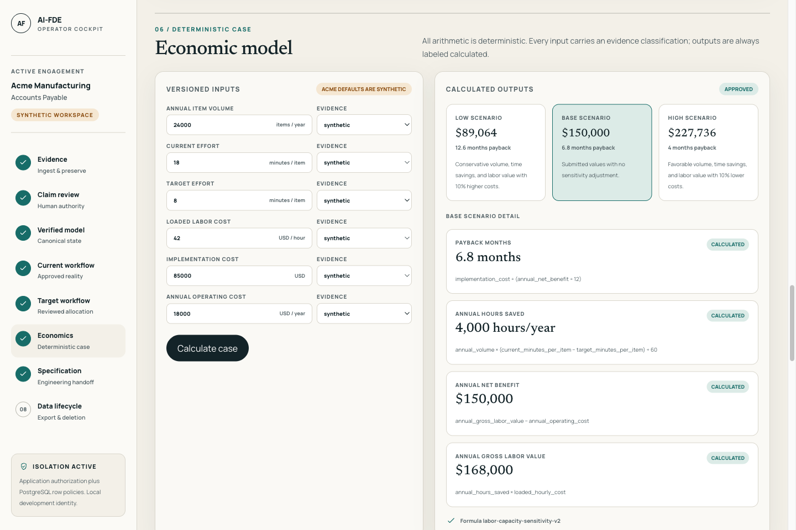
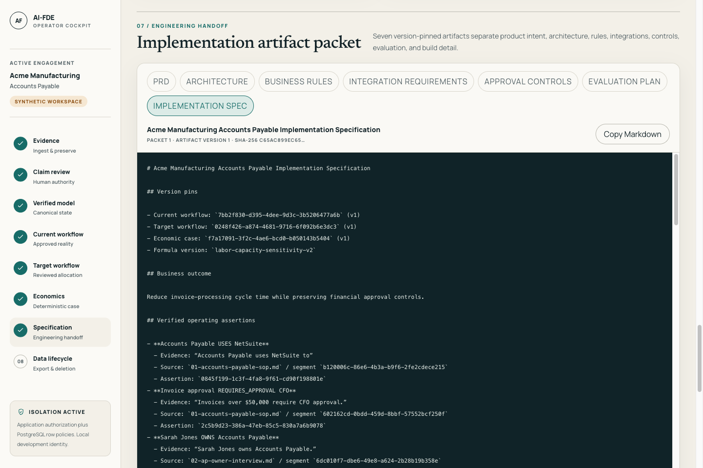
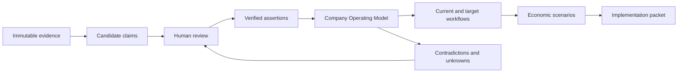
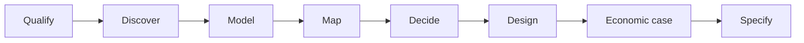
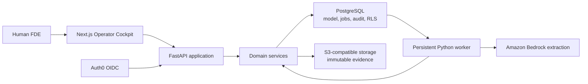

# AI-FDE

AI-FDE is a stateful operating system for internal AI teams and Forward Deployed Engineering
leaders.

It turns fragmented enterprise evidence into a verified model of how a company operates, helps a
human FDE redesign one workflow, quantifies the business case, and produces an
implementation-ready artifact packet. The goal is faster engagements, fewer delivery errors,
stronger handoffs, provable economics, and more verified value from every model token.

AI-FDE is not SellerFi. It is not a marketplace, a generic chatbot, or an autonomous coding
agent. Its purpose is to make enterprise discovery and workflow transformation more trustworthy,
repeatable, and scalable.

> **Current status: design-partner code candidate; sanitized-data no-go.** The complete synthetic
> evidence-to-specification path is implemented and locally verified. Live Auth0, AWS, restore,
> deletion-boundary, secret-rotation, and Bedrock model-evaluation evidence has not been recorded.
> Only synthetic data is allowed until every external release gate passes.

## The product in one sentence

AI-FDE helps internal AI teams and FDE leaders turn messy customer evidence into an auditable
operating model and an economically justified implementation plan—without losing the rules,
exceptions, uncertainty, or human decisions that make the business actually work.

## Product walkthrough

These screenshots show the synthetic Acme Manufacturing acceptance journey. They contain no
customer data and should not be interpreted as proof that the external production gates have
passed.

| Engagement workspace                                                                                                      | Human claim review                                                                                                        |
| ------------------------------------------------------------------------------------------------------------------------- | ------------------------------------------------------------------------------------------------------------------------- |
|  |  |

| Sensitivity economics                                                                                  | Implementation artifact packet                                                                                                   |
| ------------------------------------------------------------------------------------------------------ | -------------------------------------------------------------------------------------------------------------------------------- |
|  |  |

## The first-principles thesis

Enterprise automation depends on an accurate answer to one question:

> How does this business actually operate?

That answer rarely exists in one place. It is distributed across policies, process documents,
emails, spreadsheets, diagrams, interviews, software behavior, and individual judgment. Those
sources are incomplete. They become stale. They often contradict each other.

A document summary cannot resolve that problem. A model can summarize the wrong process with
confidence. A workflow tool can automate the process that leadership describes while missing the
exceptions that operators use every day. A coding agent can implement a precise specification
that is precisely wrong.

The required chain is:

```text
Evidence
  -> candidate claims
  -> human review
  -> verified operating model
  -> approved current workflow
  -> explicit allocation decisions
  -> approved target workflow
  -> reproducible economics
  -> version-pinned implementation artifacts
```

Each transition changes the trust level of the information. AI-FDE preserves those boundaries
instead of collapsing evidence, inference, approval, and execution into one answer.

## Problem statements

The visible failure is not one isolated tooling gap. Internal AI delivery teams experience all
four of these failures together:

| Failure             | Why it happens                                                                 | Business consequence                                                   |
| ------------------- | ------------------------------------------------------------------------------ | ---------------------------------------------------------------------- |
| Slow discovery      | Context is scattered across people, files, systems, and prior conversations    | Long time-to-value and fewer engagements per FDE                       |
| Lost context        | Decisions, exceptions, and corrections are trapped in chat or static documents | Repeated discovery, inconsistent recommendations, and avoidable rework |
| Weak specifications | Handoffs omit rules, controls, evidence, dependencies, or acceptance criteria  | Engineering churn, scope drift, and implementation errors              |
| Untrusted AI output | Generated claims are not separated from verified facts                         | Manual rechecking, low adoption, and unsafe automation decisions       |

The problem statements below describe the root causes behind those four operational failures.

### 1. Enterprise context is fragmented

The FDE must reconstruct the business from documents, conversations, systems, and tribal
knowledge. The work is slow and much of it is repeated on every engagement.

### 2. The stated process is not the actual process

Policies describe the intended path. Operators know the exception path. Systems encode another
version. Automating only the stated process creates brittle software and poor adoption.

### 3. Existing AI tools do not maintain accountable truth

Chat and retrieval tools produce useful answers, but they do not reliably preserve which source
supports a claim, who approved it, when it was valid, what conflicts with it, or which downstream
decision depends on it.

### 4. Discovery work evaporates into static documents

Notes and diagrams become stale as soon as the business changes. Corrections overwrite history.
Engineering teams receive conclusions without the evidence and decisions behind them.

### 5. Workflow design and economics are disconnected

Teams can propose automation before proving the baseline, labeling assumptions, estimating
operating cost, or testing whether the business case survives conservative conditions.

### 6. Implementation handoffs lose critical context

Rules, approval boundaries, systems of record, exceptions, and acceptance criteria are scattered
across artifacts. The implementation team must rediscover the customer or make unsafe guesses.

### 7. Pressure for autonomy arrives before the control system is ready

It is tempting to connect an agent directly to production work. Without verified state, bounded
authority, evaluation, audit, and recovery, greater autonomy amplifies uncertainty instead of
creating leverage.

## Who AI-FDE is for

AI-FDE is built for internal AI organizations that repeatedly discover, design, and deliver
enterprise AI workflows. The accountable buyer is typically an FDE leader, Head of AI Delivery,
AI transformation leader, or internal AI platform leader. They need delivery quality and capacity
to improve without scaling headcount and model spend at the same rate.

The V1 operator is a human Forward Deployed Engineer.

The FDE owns the customer relationship, interprets evidence, resolves ambiguity, approves material
decisions, and remains accountable for the final recommendation. AI-FDE accelerates the work and
preserves its reasoning trail.

The product creates value across the internal delivery system even though these stakeholders are
not all V1 operators:

| Stakeholder                     | Current pain                                                   | Value from AI-FDE                                                                   |
| ------------------------------- | -------------------------------------------------------------- | ----------------------------------------------------------------------------------- |
| Human FDE                       | Reconstructs context manually and repeatedly                   | One governed workspace from evidence through specification                          |
| FDE or AI delivery leader       | Quality and margin depend on individual memory and method      | Repeatable delivery, comparable economics, and more engagements per team            |
| Internal AI platform team       | Cannot connect model usage to accepted delivery outcomes       | Outcome-linked token, latency, quality, and cost evidence                           |
| Customer process owner          | Fears that automation will miss exceptions or remove authority | Exact provenance, visible controls, and human approval                              |
| Engineering team                | Receives incomplete or contradictory requirements              | Version-pinned rules, architecture, integrations, controls, and acceptance criteria |
| Executive sponsor               | Sees benefits without transparent assumptions                  | Reproducible low/base/high economics and explicit evidence quality                  |
| Security or compliance reviewer | Cannot see what AI changed or why                              | Engagement isolation, audit history, least privilege, and fail-closed release gates |

Customer self-service is not a V1 goal. The cockpit is built for an expert operator first.

## Value proposition

AI-FDE creates leverage across the complete internal AI delivery lifecycle.

### Faster understanding

- Ingest multiple evidence formats into one engagement.
- Extract bounded candidate claims instead of treating generated text as truth.
- Preserve exact source locations for review.
- Surface contradictions and unknowns before design begins.
- Resume work from durable state rather than reconstructing a chat session.

### Safer transformation

- Separate current state from target state.
- Make Human / Software / AI allocation explicit for every step.
- Preserve approval authority, exception paths, and systems of record.
- Prevent unresolved blocking contradictions from silently passing a stage gate.
- Make upstream changes stale downstream outputs instead of rewriting history.

### Better implementation handoffs

- Generate a consistent packet from approved source state.
- Pin every artifact to the workflow and economic versions that produced it.
- Carry business rules, controls, integration expectations, and evaluation criteria together.
- Let engineers inspect the evidence and decisions behind the specification.
- Reduce avoidable rediscovery and specification drift.

### Provable economics

- Store assumptions, evidence classifications, formulas, and approvals with the workflow version.
- Compare low, base, and high scenarios instead of presenting one optimistic estimate.
- Reproduce expected ROI from versioned inputs without asking an LLM to perform arithmetic.
- Preserve the boundary between an approved forecast and realized production value.

### Efficient model use

- Count model input and output tokens, including retries and rejected output.
- Relate model cost to accepted claims and approved delivery artifacts.
- Reuse verified structured context instead of repeatedly sending raw documents and chat history.
- Optimize for maximum **verified value per token**, not minimum token count at any cost.

The economic hypothesis is:

```text
AI-FDE value
  = discovery and documentation time avoided
  + implementation rework avoided
  + delivery capacity unlocked
  + decision and control risk reduced
  - human review and change-management cost
  - model, infrastructure, implementation, and operating cost
```

This is a product hypothesis, not a realized customer ROI claim. V1 calculates scenario-based
expected value. Live ROI telemetry is later work.

## Outcome contract

Every roadmap item should improve at least one measurable delivery outcome without weakening the
trust model.

| Outcome                 | Primary evidence                                                                       | Current boundary                                               |
| ----------------------- | -------------------------------------------------------------------------------------- | -------------------------------------------------------------- |
| Faster engagements      | Time from engagement creation to approved packet; discovery and review cycle time      | Baseline must be established with internal users               |
| Fewer errors            | Escaped contradictions, stale-output use, correction rate, and implementation rework   | Synthetic invariants are tested; live error rate is unmeasured |
| Better handoffs         | Packet completeness, engineering clarification count, and acceptance-criteria coverage | Packet generation works; real kickoff validation is next       |
| Provable ROI            | Reproducible approved forecast, then expected-versus-realized value                    | Forecasting works; realized-value telemetry is post-deployment |
| Lower token cost        | Model cost per accepted claim and per approved packet, with quality held constant      | Metadata exists; live Bedrock baseline and target remain open  |
| Lower pull-request cost | Total tokens and dollars per accepted PR, plus rework and time-to-merge                | Post-V1; coding-agent execution is not currently implemented   |

An improvement claim requires a baseline, a comparable measurement window, and a quality guardrail.
Until those exist, AI-FDE reports absolute values and does not claim a percentage reduction.

## Jobs to be done

When an FDE begins an enterprise workflow engagement, AI-FDE should help them:

1. frame the outcome and the workflow under investigation;
2. collect evidence without treating any single source as canonical;
3. identify people, systems, rules, approvals, exceptions, and relationships;
4. verify important claims against exact evidence;
5. preserve conflicts, gaps, and changes over time;
6. construct and approve the workflow as it exists today;
7. decide which steps belong to humans, deterministic software, AI, or AI with a human;
8. design a target workflow with explicit controls;
9. quantify value, cost, assumptions, and sensitivity;
10. produce a coherent implementation packet for engineering kickoff;
11. export or delete the engagement through an explicit data-lifecycle process.

## What AI-FDE is—and is not

| AI-FDE is                                  | AI-FDE is not                                      |
| ------------------------------------------ | -------------------------------------------------- |
| A durable operating system for a human FDE | A transient chat session                           |
| An evidence-to-decision workflow           | A document summarizer                              |
| A verified Company Operating Model         | An unreviewed knowledge graph                      |
| A governed transformation lifecycle        | A no-code workflow automation platform             |
| A source of implementation-ready artifacts | An autonomous software factory                     |
| A human-authoritative V1 product           | A system that silently promotes AI output to truth |
| Engagement-isolated by design              | A cross-customer memory pool                       |
| Explicit about estimates and simulations   | A source of claimed customer ROI                   |

## Why existing approaches are insufficient

AI-FDE competes most often with a stack of partial solutions rather than one direct replacement.

| Alternative                              | What it does well                                      | Where it breaks for repeated AI delivery                                              | AI-FDE's role                                                        |
| ---------------------------------------- | ------------------------------------------------------ | ------------------------------------------------------------------------------------- | -------------------------------------------------------------------- |
| Documents and spreadsheets               | Flexible capture, analysis, and familiar collaboration | Provenance, dependencies, approval state, history, and staleness stay manual          | Converts source material into reviewed, versioned operating state    |
| Generic copilots and chat assistants     | Fast exploration, drafting, and summarization          | Context is transient; fluent output can outrun evidence and authority                 | Separates candidate output from verified truth and durable decisions |
| Knowledge bases and enterprise search    | Retrieval across many sources                          | Finding a passage does not resolve conflicts, assign authority, or approve a workflow | Adds claim review, temporal state, contradictions, and stage gates   |
| Workflow and no-code automation products | Reliable execution of a known process                  | They assume the process, rules, exceptions, owners, and economics are already known   | Produces the approved target workflow and control requirements       |
| Process-mining platforms                 | Reconstruct observable system events                   | Human judgment, off-system work, policy exceptions, and intent remain incomplete      | Combines system evidence with reviewed human and document evidence   |
| Project management and ticketing tools   | Coordinate assigned implementation work                | Tickets fragment the reasoning, evidence, dependencies, and economics behind scope    | Generates a coherent, dependency-pinned engineering handoff          |
| AI evaluation and observability tools    | Measure model quality, latency, tokens, and cost       | Model metrics are not automatically tied to accepted business outcomes                | Connects usage and quality evidence to verified engagement results   |
| Consulting and delivery playbooks        | Encode expert methods and human judgment               | Quality remains difficult to reproduce, audit, compare, and compound across a team    | Turns the method into a governed, reusable operating lifecycle       |
| General-purpose coding agents            | Accelerate implementation from a clear request         | Weak or incorrect specifications create fast rework; business authority is unclear    | Makes implementation intent trustworthy before bounded execution     |

AI-FDE does not need to replace these systems. Documents remain evidence. Copilots remain useful
interfaces. Knowledge bases remain retrieval layers. Workflow products remain execution systems.
Evaluation platforms remain model telemetry. Coding agents may later consume approved WorkOrders.
AI-FDE is the governed layer that connects them: evidence becomes approved implementation intent,
and model cost becomes attributable to accepted delivery outcomes.

## The canonical model

The product's durable asset is the Company Operating Model, also called the Business Twin.

It represents:

- people, teams, departments, and roles;
- systems and systems of record;
- processes, workflow steps, transitions, and handoffs;
- policies, rules, approvals, and exception paths;
- inputs, outputs, integrations, and dependencies;
- risks, assumptions, metrics, and economic baselines;
- contradictions, unknowns, review decisions, and history.

The model is not a free-form graph. It is structured, typed, versioned, engagement-scoped, and
backed by reviewed evidence.



Documents remain evidence. Chat remains an interface. Neither becomes canonical truth.

## Trust model

AI-FDE is built around these invariants:

1. Evidence may create candidate claims. It cannot directly create verified truth.
2. Every material assertion must resolve to exact stored evidence.
3. Model confidence and human verification are separate fields.
4. Contradictions and unknowns remain visible until explicitly resolved.
5. Material stage transitions require an authenticated human decision.
6. Approved versions are immutable. Corrections create history.
7. Upstream changes mark dependent outputs stale.
8. Economic outputs are deterministic and reproduce from stored inputs and formulas.
9. Every customer-owned record belongs to one engagement.
10. Application authorization and PostgreSQL row-level policies both enforce isolation.
11. Long-running work is persistent, retryable, and visible.
12. Uploaded and retrieved content is untrusted input and cannot change system authority.
13. Synthetic fixtures and simulation values are visibly labeled.
14. Production capability is never inferred from a local test or proposed configuration.

## The V1 lifecycle

The cockpit implements a governed state machine rather than a collection of disconnected tools.



| Stage         | Core question                               | Exit evidence                                          |
| ------------- | ------------------------------------------- | ------------------------------------------------------ |
| Qualify       | What outcome and workflow matter?           | Named workflow, owner, outcome, and discovery plan     |
| Discover      | What evidence exists and what is missing?   | Required evidence plus owned open questions            |
| Model         | What is verified, conflicted, or unknown?   | Material claims reviewed and conflicts triaged         |
| Map           | How does work happen today?                 | Approved current workflow with evidence and exceptions |
| Decide        | Who or what should perform each step?       | Reviewed allocation, rationale, risks, and controls    |
| Design        | What should the target workflow be?         | Approved, versioned target workflow                    |
| Economic case | Is the change worth doing?                  | Labeled inputs, formulas, sensitivity, and approval    |
| Specify       | Is engineering intent complete and current? | Seven consistent, version-pinned artifacts             |

At every stage, the operator can inspect evidence, correct state, see blockers, leave, and resume.

## What works today

The locally verified vertical slice is:

```text
Create a named engagement
  -> ingest bounded PDF, DOCX, CSV, email, image, text, or Markdown evidence
  -> extract schema-valid candidate claims in a persistent worker job
  -> review exact provenance and accept or reject each claim
  -> construct the verified Company Operating Model
  -> preserve and resolve contradictions through audited decisions
  -> draft and approve the current-state workflow
  -> review Human / Software / AI allocations
  -> design and approve the target-state workflow
  -> calculate and approve deterministic low / base / high economics
  -> generate a dependency-pinned seven-artifact implementation packet
  -> set an explicit retention deadline
  -> export a deterministic, hash-verified portability archive
  -> permanently delete engagement content with a content-free receipt
```

The Acme Manufacturing accounts-payable engagement remains the synthetic acceptance fixture. The
product code now supports a named primary workflow and does not embed accounts-payable language in
generated workflow or artifact titles.

## Capability and boundary matrix

| Area            | Implemented and locally verified                                                                                                           | Remaining external or product boundary                      |
| --------------- | ------------------------------------------------------------------------------------------------------------------------------------------ | ----------------------------------------------------------- |
| Evidence        | Immutable, hash-verified PDF, DOCX, CSV, EML, PNG/JPEG, Markdown, and text with deterministic locators and safety bounds                   | No OCR or live source connectors                            |
| Extraction      | Provider-neutral contract; deterministic synthetic fixture; Bedrock structured output, exact offsets, fail-closed errors, and run metadata | Live model evaluation and inference-profile pinning not run |
| Verification    | Human decisions, contradictions, uncertainty, freshness, and audit events                                                                  | Deliberately human-authoritative                            |
| Operating model | Verified assertions and relationships in engagement-isolated structured state                                                              | Bounded relational model, not a universal ontology          |
| Workflows       | One named primary workflow per engagement; ownership, system-use, approval, sequence, handoff, and governance projections                  | Not multi-workflow orchestration or process mining          |
| Allocation      | Human / Software / AI / AI + Human recommendations with operator control                                                                   | No coding-agent execution or autonomous remediation         |
| Economics       | Reproducible low/base/high scenarios with labeled inputs, transforms, formulas, provenance, and ordering checks                            | No live ROI telemetry or realized-value claim               |
| Artifact packet | Version-pinned PRD, architecture, rules, integrations, controls, evaluation plan, and implementation specification                         | Markdown artifacts; no automatic code execution             |
| Authentication  | Auth0 authorization code + PKCE and opaque revocable sessions with contract tests                                                          | Live tenant validation unrun                                |
| Worker identity | Dedicated service identity, explicit engagement membership, RLS, and service audit attribution                                             | Live ECS identity validation unrun                          |
| Deployment      | Production Dockerfiles and validated AWS Terraform for Fargate, RDS, S3, KMS, ALB, ECR, and Secrets Manager                                | Not applied or rehearsed in a real AWS account              |
| Data lifecycle  | Retention, deterministic export, permanent deletion, retry state, and content-free receipts                                                | Restore and backup-expiry boundary need live rehearsal      |
| Sanitized data  | Fail-closed application, configuration, Terraform, and go/no-go gate                                                                       | Explicitly disabled until every external record passes      |

## Economic reasoning

V1 does not ask an LLM to perform arithmetic. The economic case stores explicit inputs,
classifications, transforms, formula versions, and deterministic outputs.

Every required input is labeled as measured, calculated, estimated, synthetic, or simulated.
Low/base/high scenarios vary volume, time savings, labor value, implementation cost, and annual
operating cost through explicit transforms. The system rejects a case whose benefit scenarios do
not preserve conservative ordering.

Current outputs include:

- annual hours saved;
- annual gross labor value;
- annual net benefit;
- payback period;
- low/base/high sensitivity.

These are decision inputs. They are not proof of adoption or realized ROI.

## Maximum verified value per token

Tokens are a variable delivery cost, not a measure of progress. The target is not the smallest
prompt or the cheapest model call. The target is the most accepted, reusable business value for
the complete model cost while correctness, security, and human authority remain hard constraints.

```text
verified value per token
  = accepted outcome value
  / all model input and output tokens
```

The denominator includes planning, retrieval, generation, retries, refusals, rejected claims, and
repair work. A cheap first pass that causes more review or implementation rework is less efficient,
not more efficient.

Before realized financial value exists, AI-FDE uses outcome-specific proxies rather than inventing
one universal dollar value:

| Scope                    | Efficiency measure                                                          | Quality guardrail                                                      |
| ------------------------ | --------------------------------------------------------------------------- | ---------------------------------------------------------------------- |
| Claim extraction         | Tokens and model dollars per accepted material claim                        | Precision, recall, exact provenance, and reviewer correction rate      |
| Engagement specification | Total model cost per approved, current artifact packet                      | Completeness, stale-output prevention, and engineering acceptance      |
| Delivered workflow       | Model cost compared with approved and then realized economic value          | Adoption, control failures, operational errors, and realized result    |
| Pull request, post-V1    | Planning + generation + repair tokens and dollars per accepted pull request | Required tests, human review, rework ratio, defects, and time-to-merge |

AI-FDE should improve that ratio by:

- retrieving only the exact evidence required for a decision;
- reusing the verified Company Operating Model instead of resending raw source history;
- generating typed, bounded outputs with explicit acceptance criteria;
- pinning dependencies so unchanged context is reused and changed context is visible;
- counting failed and rejected work instead of hiding it from the cost denominator;
- comparing models and prompts against the same evaluation and outcome baseline.

V1 records the extraction metadata needed to begin this measurement. Live Bedrock baselines and
targets remain release gates. Pull-request token-cost reduction is a post-V1 metric because
coding-agent execution is not implemented and no reduction can be claimed without a comparable
baseline. The durable decision is recorded in
[ADR 0015](docs/adr/0015-optimize-verified-value-per-token.md).

## The implementation packet

AI-FDE generates seven current artifacts as one atomic, dependency-pinned packet:

1. Product requirements document.
2. Architecture brief.
3. Business rules.
4. Integration requirements.
5. Approval and control matrix.
6. Evaluation plan.
7. Implementation specification.

Every artifact records the approved current workflow, target workflow, economic case, formula
version, and verified assertions used to produce it. If an upstream dependency changes, the
complete packet becomes stale. Previous versions remain available for audit.

## Architecture at a glance

AI-FDE is a modular monolith with three runtime processes and shared application services.



The architecture optimizes for a small team, transactional correctness, visible domain boundaries,
and a coherent deployment surface. Detailed choices and their tradeoffs live in the
[architecture decision index](docs/adr/README.md).

## Security and data lifecycle

AI-FDE assumes that enterprise evidence is sensitive even when a design partner provides a
sanitized dataset.

- Human operators authenticate through OIDC in production-oriented environments.
- Provider tokens remain server-side; browser sessions are opaque, revocable, and stored as hashes.
- Worker application identity is separate from human identity and cloud workload identity.
- Worker access requires explicit membership in each engagement.
- PostgreSQL row policies provide an independent tenant boundary.
- Evidence objects use engagement-scoped storage keys and immutable content hashes.
- Logs use identifiers and bounded result codes rather than evidence or raw provider payloads.
- Owners can set retention, create a portability export, and request permanent deletion.
- Deletion preserves only a content-free receipt after database and object content is removed.

The detailed procedures are documented in the
[operator authentication](docs/runbooks/auth0-operator-authentication.md),
[operator onboarding](docs/runbooks/operator-onboarding.md), and
[engagement data lifecycle](docs/runbooks/engagement-data-lifecycle.md) runbooks.

## Design-partner readiness

Repository implementation is not the same as production validation.

The following code-local gates pass:

- Python unit, acceptance, integration, and engagement-isolation tests.
- Ruff, mypy, ESLint, and TypeScript checks.
- Keyboard and automated WCAG 2.2 AA coverage for the golden cockpit flow.
- Clean database upgrade, downgrade, re-upgrade, and Alembic drift checks.
- Production Next.js build and non-root web/API/worker container builds.
- Terraform formatting and static validation.
- Clean-environment rehearsal from empty infrastructure.

The following external gates remain open:

- Auth0 behavior against a real tenant.
- AWS deployment through federated credentials.
- RDS restore and point-in-time recovery rehearsal.
- Evidence deletion and backup-expiry boundary rehearsal.
- Runtime secret rotation and prior-version invalidation.
- Bedrock model/inference-profile evaluation and pinning.
- Complete sanitized-data golden path in the deployed environment.

The authoritative release record is the
[design-partner go/no-go checklist](docs/runbooks/design-partner-go-no-go.md). Until it passes,
`sanitized_data_enabled` remains false.

## V1 scope

V1 ends at an implementation-ready specification.

It includes:

- one human FDE operator;
- one named primary workflow per engagement;
- synthetic Acme evidence and reusable workflow primitives;
- evidence ingestion, claim review, operating-model verification, workflow design, economics, and
  artifact generation;
- authentication, isolation, audit, retention, export, and deletion foundations;
- a production-oriented AWS deployment definition and readiness gate.

It does not include:

- customer self-service;
- autonomous discovery or material business approval;
- coding-agent dispatch or remediation;
- automatic production changes;
- live email, Slack, ERP, or document-repository connectors;
- multi-workflow opportunity ranking;
- process mining from production telemetry;
- a general ontology editor or graph database;
- multi-region infrastructure, billing, or enterprise administration;
- claims of production adoption or realized ROI.

## Long-term direction

AI-FDE should earn autonomy in controlled stages:

1. **Assistant:** organize evidence and accelerate the human FDE.
2. **Copilot:** recommend decisions through bounded, reviewable tools.
3. **Bounded autonomous FDE:** execute explicitly approved work inside strong policy and evaluation
   boundaries.
4. **Governed transformation system:** maintain operating models and workflows through measured
   production feedback.

The long-term north star is that one human FDE can transform and maintain many customer
environments without proportional growth in delivery headcount or model spend. Engagement volume,
quality, realized value, and verified value per token must improve together.

Autonomy is earned through evidence. It is not assumed because a model is capable.

## Measures of success

The first milestone measures credibility and delivery leverage rather than vanity usage:

- 100% of accepted material assertions have inspectable evidence.
- 100% of consequential operator and worker mutations appear in the audit trail.
- 100% of seeded critical rules and exceptions are surfaced in the acceptance dataset.
- Zero silent conflicts.
- Zero successful cross-engagement access in automated isolation tests.
- Economic outputs reproduce from stored versioned inputs.
- Every current packet member references one approved dependency set.
- An FDE can complete the golden path without editing the database or generated artifacts by hand.
- The resulting packet is usable for a real engineering kickoff.
- Engagement lead time is measurable from creation through approved packet.
- Model tokens, cost, latency, and acceptance yield are attributable to the engagement.
- Model cost per accepted material claim and approved packet is reproducible.
- Handoff quality is measured through completeness, clarification requests, and engineering acceptance.

Extraction precision, recall, latency, and cost thresholds must be set through the live Bedrock
evaluation before sanitized customer use. Reduction targets for discovery time, rework, token cost,
and pull-request cost require internal baselines before AI-FDE can make a percentage claim.

## Run locally

### Prerequisites

- Docker Desktop
- Python 3.13
- [`uv`](https://docs.astral.sh/uv/)
- Node.js 20.9 or newer
- [`pnpm`](https://pnpm.io/) 10

### Start the stack

```bash
cp .env.example .env
make setup
make infrastructure
make migrate
make seed
make dev
```

`make seed` is idempotent and loads only the synthetic Acme Manufacturing fixture. `make dev`
starts the API, persistent worker, and web application together.

| Service           | Local address                                                        |
| ----------------- | -------------------------------------------------------------------- |
| Operator Cockpit  | [http://localhost:3000](http://localhost:3000)                       |
| API health        | [http://localhost:8000/api/health](http://localhost:8000/api/health) |
| API documentation | [http://localhost:8000/docs](http://localhost:8000/docs)             |
| PostgreSQL        | `localhost:55432`                                                    |
| MinIO API         | `localhost:59000`                                                    |
| MinIO console     | [http://localhost:59001](http://localhost:59001)                     |

The default configuration uses a visibly labeled development identity. It cannot run outside the
development environment and cannot authorize sanitized engagements.

## Walk the golden path

Run the complete production-mode synthetic journey in a disposable environment:

```bash
make demo-rehearsal
```

The command migrates an empty database, seeds Acme, starts the API, persistent worker, and optimized
web server, drives every material decision in Chromium, verifies the seven-artifact packet, captures
a local screenshot, and removes its containers and volumes. See the
[sample demo runbook](docs/runbooks/sample-demo.md) for the talk track, expected results, failure
recovery, and the latest rehearsal record.

For a human-operated walkthrough against the normal development stack:

1. Open the Operator Cockpit and select **Acme Manufacturing**.
2. Wait for the worker to process the synthetic evidence.
3. Review candidate claims beside their exact source excerpts.
4. Accept or reject claims and inspect the verified operating model.
5. Resolve the blocking approval contradiction.
6. Generate and approve the current-state workflow.
7. Review the Human / Software / AI allocation for every step.
8. Generate and approve the target-state workflow.
9. Review the economic inputs, formulas, provenance labels, and scenarios.
10. Approve the economic case and generate the seven-artifact packet.
11. Set retention and download the portability archive.
12. Exercise permanent deletion only after the export and confirmation gates pass.

The acceptance and isolation suites exercise this lifecycle.

## Quality commands

```bash
make test           # complete Python suite
make lint           # Ruff, mypy, ESLint, and TypeScript
make acceptance     # golden path and tenant isolation
make accessibility  # WCAG 2.2 AA axe and keyboard checks
make terraform-check
make rehearse        # clean isolated build and test rehearsal
make demo-rehearsal   # clean production-mode browser golden path
pnpm build           # production Next.js build
uv run alembic check
```

Database changes must also pass a clean upgrade, safe downgrade where supported, re-upgrade, and
row-isolation verification.

## Repository map

```text
apps/web/                  Next.js Operator Cockpit
apps/api/                  thin FastAPI entrypoint
apps/worker/               thin persistent-worker entrypoint
docker/                    production web, API, and worker images
infrastructure/terraform/  AWS design-partner stack
src/ai_fde/modules/        domain-oriented application services
src/ai_fde/adapters/       object-storage and extraction providers
migrations/                ordered PostgreSQL migrations
fixtures/acme/             explicitly synthetic evidence
tests/acceptance/          complete lifecycle tests
tests/isolation/           authorization and row-policy tests
docs/product/              vision and product requirements
docs/architecture/         system, domain, and operating-model design
docs/adr/                  accepted decisions and tradeoffs
docs/runbooks/             operator, lifecycle, deployment, and release procedures
```

The API and worker mutate state through the same domain services. Customer evidence, credentials,
runtime databases, Terraform state, and real exports must never be committed.

## Documentation

Start with the [documentation index](docs/README.md).

- [Product vision](docs/product/vision.md)
- [V1 product requirements](docs/product/prd.md)
- [System architecture](docs/architecture/system-architecture.md)
- [Domain model](docs/architecture/domain-model.md)
- [Company Operating Model schema](docs/architecture/company-operating-model.md)
- [FDE lifecycle](docs/methodology/fde-lifecycle.md)
- [Architecture decisions](docs/adr/README.md)
- [Implementation roadmap](docs/roadmap/implementation-roadmap.md)
- [Active backlog](docs/backlog/initial-backlog.md)
- [End-to-end test strategy](docs/testing/end-to-end-test-strategy.md)
- [Design-partner delivery plan](docs/delivery/design-partner-delivery-plan.md)
- [Sample demo runbook](docs/runbooks/sample-demo.md)
- [Repeatable rehearsal implementation plan](docs/plans/2026-08-14-feat-repeatable-e2e-delivery-rehearsal-plan.md)
- [Design-partner readiness plan](docs/plans/2026-08-12-feat-design-partner-readiness-plan.md)
- [AWS deployment guide](infrastructure/terraform/design-partner/README.md)
- [Design-partner go/no-go record](docs/runbooks/design-partner-go-no-go.md)

## Current decision

AI-FDE has a credible, locally verified evidence-to-specification foundation. It is ready for live
infrastructure and provider validation. It is not yet approved for sanitized customer data.

The next correct move is to complete the external identity, deployment, recovery, deletion, secret,
and extraction evaluations. The next move is not to add coding-agent autonomy.
