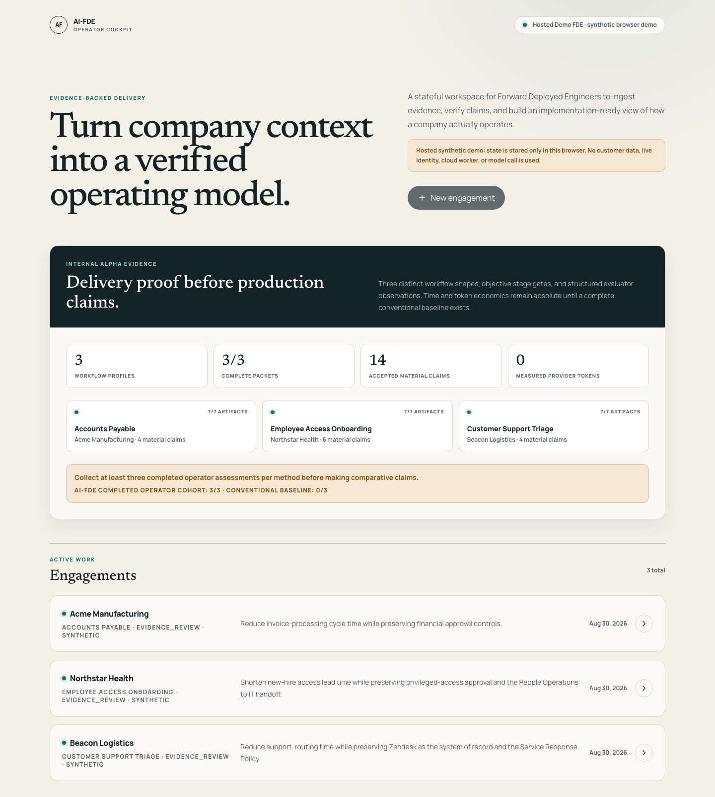
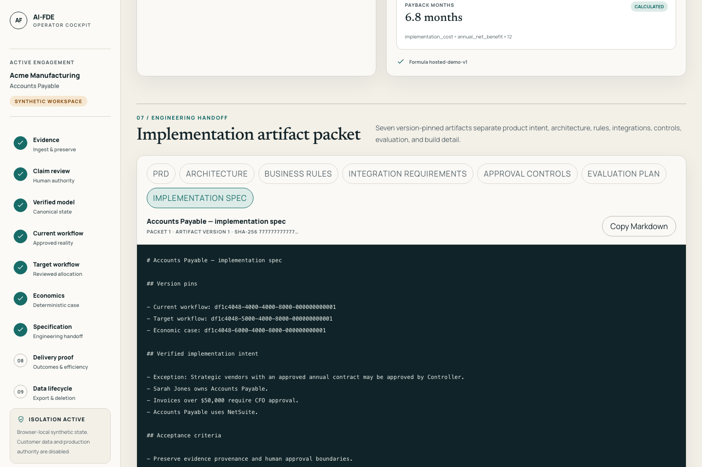

# FDLC Factory Deployed Engineer

## Turn enterprise reality into a deployable software factory

The **FDLC Factory Deployed Engineer**, or **Factory Engineer**, is the evidence-backed operating workspace for a human Factory Deployed Engineer. It turns fragmented enterprise source evidence into a verified operating model, helps redesign a workflow, quantifies the business case, and produces a version-pinned implementation packet for engineering.

The repository and internal compatibility identifiers remain **AI-FDE** where renaming would add migration risk.

The project explores a core problem in AI-native delivery:

> Before autonomous agents can safely build or automate a business workflow, the system needs trustworthy implementation intent.

Factory Engineer is the governed layer between messy enterprise reality and downstream execution.

```text
Source evidence
  → candidate claims
  → human review
  → verified operating model
  → approved current workflow
  → Human / Software / AI allocation
  → approved target workflow
  → reproducible economics
  → ranked factory opportunities
  → explainable FDLC readiness
  → approved immutable deployment package
  → authenticated Mission Control handoff
```

## Why this matters

Enterprise AI projects rarely fail because a model cannot generate code. They fail because implementation begins from incomplete context, undocumented exceptions, weak economics, unclear authority, or requirements that were never verified against how the business actually operates.

Factory Engineer is designed to make that discovery-to-delivery path **repeatable, auditable, evidence-backed, and measurable**.

## What the system does

- ingests enterprise evidence into an engagement-scoped workspace
- extracts bounded candidate claims instead of silently promoting generated text to truth
- preserves exact source provenance for human review
- surfaces blocking approval-rule contradictions, rules, approvals, and exception paths
- builds a typed verified Company Operating Model projection
- separates current-state workflow from target-state design
- makes Human / deterministic software / AI allocation explicit
- models low/base/high economics from stored assumptions and formulas
- generates version-pinned implementation artifacts and acceptance criteria
- tracks model tokens, latency, result codes, and accepted outcomes
- preserves audit history and human approval boundaries

## Product thesis

A coding agent can implement a precise specification that is precisely wrong.

Factory Engineer therefore keeps four things separate:

1. **Source evidence** — what customer material actually says
2. **Inference** — what AI proposes from that evidence
3. **Approval** — what a human accepts as authoritative
4. **Execution intent** — what downstream engineering systems are allowed to build

That separation creates a safer bridge from enterprise discovery to AI-native engineering execution.

## Trust model

- Evidence may create candidate claims but cannot directly create verified truth.
- Material assertions must resolve to stored evidence.
- Model confidence and human verification are separate.
- Contradictions remain visible until explicitly resolved.
- Approved versions are immutable.
- Upstream changes stale dependent downstream artifacts.
- Economic outputs reproduce from stored inputs and formulas.
- Customer records remain engagement-scoped.
- Long-running work is persistent, retryable, and observable.
- Uploaded content is untrusted input and cannot expand system authority.

## Relationship to autonomous software delivery

Factory Engineer, the [FDLC Framework](https://fdlc.ai/framework), the [AI Software Factory Guide](https://ai-software-factory-mastery.vercel.app), and [Mission Control](https://fdlc.ai/mission-control) solve different layers of the same broader problem.

**Factory Engineer** turns uncertain enterprise evidence into governed implementation intent.

**Mission Control** turns governed implementation intent into bounded agent execution, verification, evidence, pull requests, and human decisions.

```text
Enterprise evidence
      ↓
Factory Engineer
      ↓
Verified implementation intent
      ↓
 Mission Control / Software Factory
      ↓
Bounded agent execution
      ↓
Verification + evidence
      ↓
Human-approved delivery
```

## Current status

**Internal-alpha code candidate; synthetic-data only.**

The synthetic evidence-to-specification path is implemented across multiple workflow shapes with structured delivery assessments and an objective program scorecard. External production gates—including live identity/cloud controls, restore/deletion evidence, secret rotation, and model-evaluation evidence—remain intentionally fail-closed.

The repository does not claim production readiness or realized customer ROI. Current economics are scenario-based and reproducible from versioned inputs.

## Hosted demonstrations

[Open the current production demonstration](https://ai-fde-agent.vercel.app).

The production alias currently runs the Phase 1 explicitly labeled, deterministic, synthetic operator workflow. The Phase 2 release candidate adds factory-opportunity comparison and selection, seven-stage FDLC readiness, digest-bound package approval/publication, and a simulated Mission Control retrieval. Phase 2 is deployed to a commit-specific Vercel preview and smoke-tested before any separate production promotion.

Demo state is stored in the evaluator's browser. It can be reset by clearing site data. The hosted demo makes no model call, accepts no customer data, and does not claim live PostgreSQL isolation, Auth0 validation, a persistent worker, AWS object storage, Bedrock extraction, or production readiness. Those capabilities remain on the real FastAPI deployment path and fail closed until their external gates are satisfied.

Preview builds are deployed from the repository root with the Vercel project root configured as `apps/web`. The Next.js configuration fails the Vercel build unless both safety variables are present:

```bash
vercel link --yes --project ai-fde-agent
vercel deploy . \
  --build-env NEXT_PUBLIC_AI_FDE_HOSTED_DEMO=true \
  --build-env NEXT_PUBLIC_AI_FDE_API_URL=https://api.ai-fde.invalid/api \
  -y
```

Production promotion is an explicit follow-on decision after preview acceptance; it uses the same
verified commit and safety variables with `vercel deploy . --prod`.

The invalid API URL is intentional in hosted-demo mode: browser requests are handled by the synthetic adapter and cannot silently fall through to an unvalidated service.

Run the Phase 2 golden path and accessibility checks against the commit-specific preview URL
returned by Vercel (replace the example host below):

```bash
AI_FDE_PLAYWRIGHT_BASE_URL=https://replace-with-preview.vercel.app \
AI_FDE_PLAYWRIGHT_EXTERNAL_SERVER=true \
pnpm --dir apps/web run test:e2e:golden

AI_FDE_PLAYWRIGHT_BASE_URL=https://replace-with-preview.vercel.app \
AI_FDE_PLAYWRIGHT_EXTERNAL_SERVER=true \
pnpm --dir apps/web run test:e2e:alpha

AI_FDE_PLAYWRIGHT_BASE_URL=https://replace-with-preview.vercel.app \
AI_FDE_PLAYWRIGHT_EXTERNAL_SERVER=true \
pnpm --dir apps/web run test:a11y
```

Prior Phase 1 production browser evidence:





## Technical themes

- stateful agent workflows
- evidence provenance and human verification
- typed operating models / knowledge graphs
- contradiction and uncertainty management
- deterministic economics
- stage-gated workflow state machines
- durable execution and recovery
- tenant/engagement isolation
- evaluations and outcome-linked model telemetry
- versioned implementation artifacts
- least-privilege authority boundaries

## North Star

Make deploying an AI software factory faster without sacrificing evidence, verification, economics, security, accountability, or human authority.

## Factory Engineer evolution

The evidence-backed audit, ecosystem boundary, target domain model, UX map, Mission Control contract, and incremental plan are indexed in [docs/fdlc-factory-engineer/README.md](docs/fdlc-factory-engineer/README.md).
