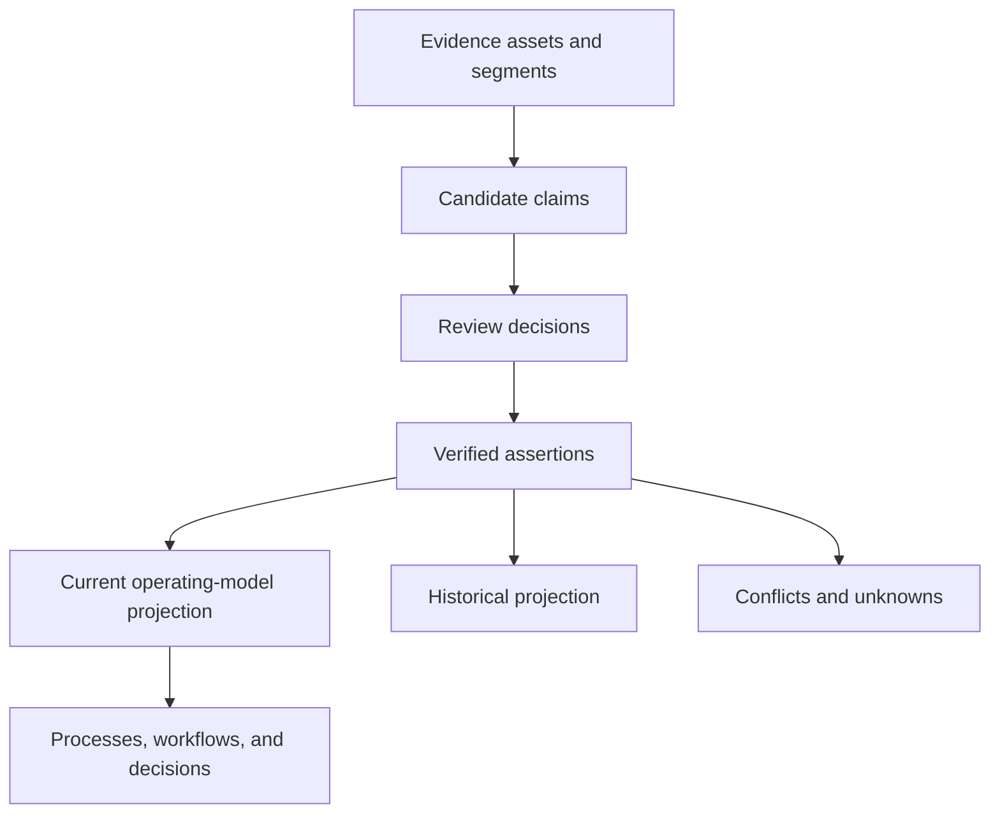

# Company Operating Model Schema

**Status:** Accepted for V1
**Date:** 2026-08-08

## 1. Purpose

The Company Operating Model is the canonical, evidence-backed representation of how an organization operates. It must answer what is believed, why it is believed, when it was true, who verified it, what conflicts with it, and which downstream decisions depend on it.

The model is not a free-form knowledge graph. It combines typed business entities, versioned relationships, reviewed assertions, and exact provenance.

## 2. Knowledge Layers

Each layer has a different trust level. The UI must not collapse them into one undifferentiated answer.

## 3. V1 Entity Types

V1 supports only the types needed for the AP proof:

- Company
- Department
- Team
- Person
- Role
- System
- Document
- Policy
- Process
- Workflow
- WorkflowStep
- Rule
- Decision
- Approval
- Exception
- FailureMode
- Input
- Output
- Metric
- Integration
- Assumption
- Risk

Adding a type requires its validation rules, display behavior, allowed relationships, and export shape. V1 does not create a universal ontology editor.

## 4. V1 Relationship Types

- `OWNS`
- `PERFORMS`
- `APPROVES`
- `DEPENDS_ON`
- `PRECEDES`
- `USES`
- `READS`
- `WRITES`
- `GENERATES`
- `TRIGGERS`
- `ESCALATES_TO`
- `GOVERNED_BY`
- `REQUIRES`
- `CONSUMES`
- `PRODUCES`
- `INTEGRATES_WITH`
- `AFFECTS`
- `CONTRADICTS`
- `SUPERSEDES`
- `VALIDATED_BY`
- `AUTOMATED_BY`

Relationship types are controlled values in V1. A proposed new type enters review instead of silently extending the ontology.

## 5. Logical Tables

Names are logical and may be refined before the first migration.

### Evidence

| Table | Important fields |
| --- | --- |
| `evidence_assets` | id, engagement_id, source_type, source_uri, object_key, content_hash, source_timestamp, ingested_at, retention_state |
| `evidence_segments` | id, asset_id, segment_type, ordinal, text, locator_json, embedding, parser_version |
| `extraction_runs` | id, engagement_id, prompt_version, model, schema_version, status, started_at, completed_at, cost |
| `candidate_claims` | id, extraction_run_id, subject_ref, predicate, object_ref_or_value, confidence, materiality, status |
| `claim_evidence` | claim_id, segment_id, locator_override, support_type |
| `review_decisions` | id, claim_id, reviewer_id, decision, edited_value, reason, created_at |

### Identities and Model

| Table | Important fields |
| --- | --- |
| `operating_entities` | id, engagement_id, entity_type, canonical_key, created_at, retired_at |
| `entity_versions` | id, entity_id, version, display_name, attributes_json, valid_from, valid_until, recorded_at, superseded_at |
| `entity_aliases` | id, entity_id, alias_type, alias_value, normalized_value, confidence, verified |
| `identity_candidates` | id, left_entity_id, right_entity_id, confidence, evidence_json, status, resolved_by |
| `relationships` | id, engagement_id, relationship_type, subject_entity_id, object_entity_id |
| `relationship_versions` | id, relationship_id, version, attributes_json, valid_from, valid_until, recorded_at, superseded_at, status |
| `assertions` | id, engagement_id, subject_entity_id, predicate, object_entity_id, value_json, status, confidence, valid_from, valid_until, recorded_at, superseded_at |
| `assertion_evidence` | assertion_id, segment_id, support_type, review_decision_id |

### Uncertainty and Change

| Table | Important fields |
| --- | --- |
| `contradictions` | id, engagement_id, left_assertion_id, right_assertion_id, severity, blocking, status, resolution |
| `unknowns` | id, engagement_id, question, importance, blocking, owner_id, evidence_needed, status, resolution_assertion_id |
| `model_changes` | id, engagement_id, change_type, actor, reason, before_version, after_version, created_at |
| `model_snapshots` | id, engagement_id, sequence, created_at, content_hash |

### Processes and Decisions

Typed process and workflow tables live beside the general model. They use operating-model entity identifiers where appropriate and retain evidence links.

| Table | Important fields |
| --- | --- |
| `processes` | id, engagement_id, canonical_key |
| `process_versions` | id, process_id, version, name, owner_entity_id, trigger, status, model_snapshot_id |
| `workflows` | id, process_id, workflow_kind |
| `workflow_versions` | id, workflow_id, version, status, based_on_version_id, model_snapshot_id |
| `workflow_steps` | id, workflow_version_id, stable_key, step_type, name, owner_entity_id, system_entity_id, attributes_json |
| `workflow_transitions` | id, workflow_version_id, from_step_id, to_step_id, condition, transition_type |
| `workflow_rules` | id, workflow_version_id, step_id, rule_entity_id, expression, priority |
| `workflow_evidence` | workflow_version_id, step_or_transition_id, assertion_id |

## 6. Temporal Semantics

The model tracks two times:

- **Valid time:** when the business statement was true.
- **Recorded time:** when AI-FDE learned or accepted it.

V1 uses immutable versions with `valid_from`, `valid_until`, `recorded_at`, and `superseded_at`. A later correction does not erase what AI-FDE believed earlier.

The current view selects the latest verified, non-superseded version valid for the requested date. Historical views use the same records with a different date or recorded-time boundary.

## 7. Provenance

Every material assertion and workflow element must resolve to:

1. the evidence asset;
2. the exact segment and locator;
3. the extraction run, if AI extracted it;
4. the review decision;
5. the actor who verified it;
6. later assertions that supersede or dispute it.

Locators support page and bounding box, paragraph, spreadsheet sheet and cell range, email message identifier, Slack message timestamp, and transcript speaker time range.

## 8. Confidence and Verification

`confidence` is model confidence. It is never a substitute for `status` or human verification.

Material claims include approvals, business rules, exceptions, failure costs, economic baselines, and authority. They always require human review in V1 regardless of confidence.

Low-risk descriptive claims may support bulk acceptance, but the resulting review actor and policy remain recorded.

## 9. Contradictions

A contradiction is created when two claims or assertions cannot both describe the same context and valid time. The system must first test whether the difference is:

- a true conflict;
- a scoped exception;
- a change over time;
- different terminology;
- different entities;
- insufficient context.

The AP acceptance case must preserve both the written CFO-approval rule and the interview evidence for the strategic-vendor controller exception. It must ask for resolution before approving an unsafe workflow.

## 10. Query Contract for Agents

Agents query a model snapshot through bounded services:

- find entities by type, alias, or relationship;
- fetch current or historical assertions;
- traverse a bounded relationship path;
- list contradictions and unknowns;
- fetch exact supporting evidence;
- inspect process and workflow versions;
- propose claims, model changes, or new workflow drafts.

Agents cannot silently verify claims, resolve material contradictions, mutate approved versions, or query outside their engagement.

## 11. Migration Discipline

- All schema changes use reviewed migrations.
- Seed fixtures use public identifiers and deterministic generation.
- Migrations preserve provenance and engagement identifiers.
- A graph database, if ever introduced, becomes a projection first. PostgreSQL remains authoritative until an explicit ADR changes it.
