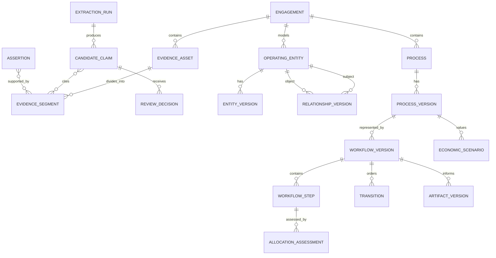

# Domain Model

**Status:** Accepted for V1
**Date:** 2026-08-08

## 1. Modeling Rules

- Stable identities and mutable versions are separate.
- Evidence is immutable. Reviews and supersession add records.
- Candidate claims are not verified assertions.
- Current state is a projection over versioned records, not destructive updates.
- Every customer-owned aggregate belongs to one engagement.
- Derived outputs pin every upstream version they use.
- Deterministic calculations are reproducible from stored inputs and formula versions.

## 2. Core Aggregates

### Engagement

Owns the customer workspace and lifecycle.

Key concepts: `Engagement`, `EngagementMember`, `LifecycleState`, `StageTransition`, `StageGate`, `Override`.

### Evidence

Preserves source material and exact citation locations.

Key concepts: `EvidenceAsset`, `EvidenceVersion`, `EvidenceSegment`, `EvidenceLocator`, `IngestionJob`.

### Knowledge Review

Separates model output from accepted truth.

Key concepts: `ExtractionRun`, `CandidateClaim`, `ClaimEvidence`, `ReviewDecision`, `IdentityCandidate`, `Contradiction`, `Unknown`.

### Company Operating Model

Represents the current and historical Business Twin.

Key concepts: `OperatingEntity`, `EntityVersion`, `EntityAlias`, `Relationship`, `RelationshipVersion`, `Assertion`, `AssertionEvidence`.

### Process and Workflow

Represents current and target operations without overwriting either.

Key concepts: `Process`, `ProcessVersion`, `Workflow`, `WorkflowVersion`, `WorkflowStep`, `Transition`, `Rule`, `ExceptionPath`, `ApprovalControl`.

### Decisioning

Records recommendations and human decisions separately.

Key concepts: `AllocationAssessment`, `AllocationFactor`, `ExecutorRecommendation`, `ControlRecommendation`, `OperatorDecision`.

### Economics

Stores baselines and scenarios with labeled evidence quality.

Key concepts: `MetricDefinition`, `BaselineObservation`, `EconomicScenario`, `ScenarioInput`, `ScenarioResult`, `FormulaVersion`.

### Artifacts

Packages approved business state into implementation-ready documents.

Key concepts: `Artifact`, `ArtifactVersion`, `ArtifactPacket`, `EvaluationPlan`.

WorkOrders, agent runs, tool invocations, and sandbox policy are reserved for the post-V1 coding-
agent phase and are not V1 aggregates.

## 3. High-Level Relationships

## 4. State Models

### Candidate Claim

`candidate → accepted | edited | rejected | deferred`

Accepting or editing creates a verified assertion through an application command. Re-review does not mutate the original extraction output.

### Assertion

`verified → superseded | disputed | retired`

An assertion may become current again only through a new version and review decision.

### Contradiction

`open → investigating → resolved | accepted_exception | not_a_conflict`

Resolution links the resulting assertion, rule, exception, or unknown.

### Workflow Version

`draft → in_review → approved → superseded | rejected`

Approved versions are immutable. A change creates a new draft.

### Artifact Version

`generating → current | failed → stale | superseded`

An upstream change marks dependent current artifacts stale. It does not delete them.

## 5. Key Invariants

1. A record cannot reference an object from another engagement.
2. A verified assertion has at least one evidence link or an explicit authorized exception.
3. One stable identity may have many aliases. Candidate matches do not merge identities.
4. An approved workflow version is immutable.
5. An approved target workflow references an approved current workflow version.
6. An economic result references immutable input and formula versions.
7. A specification references approved operating-model and workflow versions.
8. Deletion and retention operations preserve required audit metadata without retaining prohibited content.
9. Permanent engagement deletion requires a current portability export and preserves only a
    content-free, operator-scoped receipt outside the engagement aggregate.

## 6. Domain Services

Use domain services only for logic spanning aggregates:

- `ClaimReviewService`
- `IdentityResolutionService`
- `ContradictionDetectionService`
- `StageGateService`
- `WorkflowValidationService`
- `AllocationRecommendationService`
- `EconomicCalculationService`
- `ArtifactFreshnessService`

LLM calls are adapters used by application workflows. They are not domain services and cannot bypass invariants.

## 7. Domain Events

Initial event names:

- `engagement.created`
- `evidence.ingested`
- `extraction.completed`
- `claim.reviewed`
- `assertion.verified`
- `contradiction.opened`
- `operating_model.changed`
- `workflow.approved`
- `economic_case.approved`
- `artifact.generated`
- `artifact.marked_stale`

Events carry identifiers, versions, actor, engagement, causation, and correlation. They do not carry raw evidence content by default.
