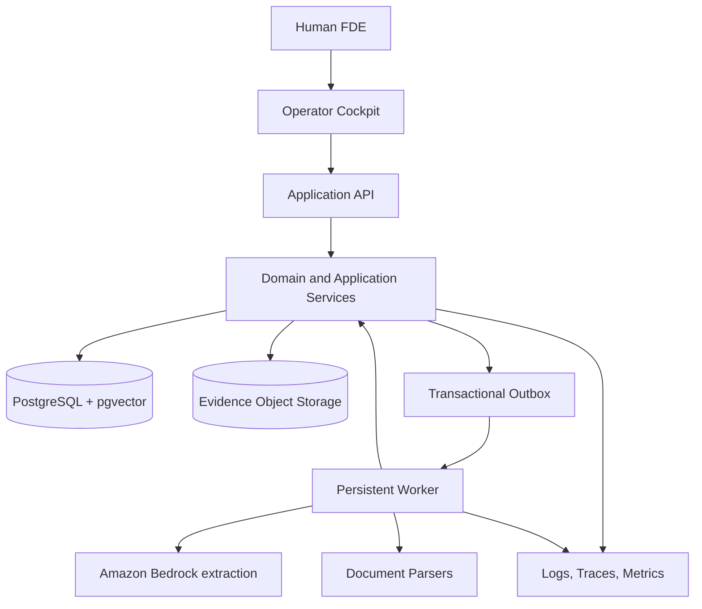

# System Architecture

**Status:** Accepted for V1
**Date:** 2026-08-08

## 1. Architectural Goal

Build a stateful FDE operating system whose durable value is an evidence-backed Company Operating Model. The architecture must support one trustworthy vertical slice now and sanitized customer data next without a rewrite.

## 2. Core Principles

1. The Company Operating Model is canonical. Raw files and chat history are not.
2. Evidence, candidate claims, reviewed assertions, and derived recommendations are separate records.
3. Every material output points to the exact model and workflow versions used to create it.
4. Long-running work is persistent, resumable, idempotent, and visible.
5. Deterministic rules stay in code. Prompts handle bounded interpretation and judgment.
6. The UI and agents use the same application services. Agent activity is never hidden from the operator.
7. Security boundaries and approval rules are enforced in code, not delegated to model judgment.
8. Start as one deployable system with strong modules. Split services only when measurements justify it.

## 3. System Context

## 4. Deployable Shape

V1 is a modular monolith with three process types:

- **Web:** Next.js and TypeScript for the cockpit.
- **API:** FastAPI and Python for synchronous application commands and queries.
- **Worker:** The same Python application package running persistent jobs and bounded claim extraction.

The API and worker share domain and application code. They deploy together and use one PostgreSQL database. No internal network API separates domain modules.

Production uses one-region AWS Fargate, private RDS PostgreSQL, KMS-encrypted S3, and Amazon Bedrock. Extraction remains behind a provider-neutral application contract, while the selected production provider and model or inference profile are explicitly configured and evaluated.

## 5. Domain Modules

| Module | Responsibility | Must not own |
| --- | --- | --- |
| Identity and Access | Users, roles, engagement access | Business workflow decisions |
| Engagements | Workspace, lifecycle, stage gates | Evidence parsing |
| Evidence | Assets, segments, locators, retention | Accepted business truth |
| Knowledge | Extraction runs, claims, reviews, contradictions, unknowns | Workflow rendering |
| Operating Model | Entities, aliases, relationships, assertions, temporal projections | Raw provider responses |
| Processes | Processes, workflow versions, steps, transitions, rules, exceptions | UI layout |
| Decisioning | Human / Software / AI recommendations and controls | Direct workflow mutation |
| Economics | Baselines, scenarios, formulas, sensitivity | LLM-generated arithmetic |
| Artifacts | Versioned PRD, architecture, evaluation, and WorkOrder outputs | Canonical business state |
| Orchestration (post-V1) | Future agent runs, tools, sandbox policy, and WorkOrder execution | Any V1 production mutation |
| Audit | Append-only domain and action history | Mutable application state |

Modules expose typed commands, queries, and events. Direct cross-module table writes are forbidden.

## 6. Data Flow

```mermaid
flowchart LR
    A["Immutable evidence asset"] --> B["Addressable segments"]
    B --> C["Extraction run"]
    C --> D["Candidate claims"]
    D --> E["Human review"]
    E --> F["Verified assertions"]
    F --> G["Current model projection"]
    G --> H["Current workflow version"]
    H --> I["Allocation decision"]
    I --> J["Target workflow version"]
    J --> K["Economic scenario"]
    K --> L["Versioned specifications"]
```

Rejected claims remain for audit. Superseded assertions remain historical. Derived state can be rebuilt from reviewed source state and versioned rules.

## 7. Ingestion Pipeline

1. Accept upload and create an evidence record.
2. Compute the content hash and reject or link exact duplicates within the same engagement. Never link evidence objects across engagements. Operator notes use an immutable note version as their evidence asset.
3. Store the original object in an engagement-scoped location.
4. Parse text and structure into stable evidence segments.
5. Run schema-constrained extraction against selected segments.
6. Normalize extracted subjects, predicates, objects, and locators.
7. Detect candidate identity matches and contradictions.
8. Place material claims in the review inbox.
9. Apply accepted reviews transactionally to the operating model.
10. Emit model-change events and mark downstream artifacts stale.

Each step has an idempotency key and can resume after failure.

## 8. Post-V1 Agent Architecture

Coding-agent execution and autonomous remediation are not part of V1. The following is an
evolution boundary, not a currently deployed capability.

A future agent runtime would support different configurations for discovery, workflow critique,
specification generation, and coding orchestration.

An agent run includes:

- objective and explicit completion criteria;
- engagement, model, and workflow version context;
- bounded context pack assembled from structured state;
- allowed tools and policy;
- model and prompt version;
- time, token, tool, and cost budgets;
- checkpoint and resume state;
- explicit success, blocked, failed, cancelled, or expired completion;
- evaluation and audit records.

### Tool Design

Future agents would receive small domain tools such as `search_entities`,
`read_assertion_evidence`, `propose_claim`, `list_unknowns`, and `draft_workflow_version`. They
would not receive raw database access.

The tools are composable and provide outcome parity with the cockpit, but safety invariants remain in application services. Immutable evidence is retired through policy rather than silently deleted. Approval tools separate propose from apply.

### Context Discipline

Future agents would reason over a structured snapshot of the approved operating model. They could
retrieve exact evidence for verification. Raw documents would not be injected wholesale as an
alternative source of truth.

Long runs refresh the snapshot or stop if the referenced model version becomes stale.

## 9. State, Events, and Jobs

- PostgreSQL stores domain state, job state, audit events, and the outbox.
- Domain mutations and outbox events commit in one transaction.
- Workers lease jobs with an expiry and heartbeat.
- Retries use exponential backoff and idempotency keys.
- Poison jobs enter a failed state with an operator-visible recovery action.
- The web app receives status through polling first. Server-sent events may be added when useful.

The persistent job interface may later be backed by Temporal. V1 does not require that operational dependency.

## 10. Data Stores

### PostgreSQL

Stores engagements, access, evidence metadata, segments, knowledge state, model versions, workflow versions, economics, artifacts, agent runs, jobs, and audit records.

Use pgvector only for candidate retrieval. Similarity never establishes truth or authorization.

### Object Storage

Stores immutable source files and large generated artifacts. Objects use engagement-scoped keys, content hashes, encryption, and retention metadata.

### No V1 Cache

Do not introduce Redis until measured load or coordination requires it. Correctness must not depend on a cache.

## 11. Security Boundaries

- Authenticate the operator through OIDC before sanitized customer use.
- Authorize every command and query against engagement membership and role.
- Enforce engagement isolation in application services and PostgreSQL row-level security.
- Add row-level policies with each engagement-owned table migration and complete a full policy audit before design-partner release.
- Use separate runtime identities for web, API, worker, and migration. A future sandbox control
  plane must receive its own identity before it can be enabled.
- Keep model-provider and sandbox credentials outside application data.
- Treat all ingested content as untrusted. Scan files and prevent prompt text from changing tool policy.
- Test indirect prompt injection through documents, notes, model fields, and retrieved evidence.
- Require deny-by-default sandbox network, filesystem, command, secret, duration, and budget
  policies before any post-V1 coding-agent execution is enabled.
- Redact sensitive payloads from telemetry. Store hashes and references where full content is unnecessary.
- Record retention, legal hold, export, and deletion state before sanitized customer ingestion.

## 12. Observability and Audit

V1 telemetry covers request, job, and provider operations. Future tool and sandbox operations must
use the same metadata-only discipline. Domain events use stable low-cardinality names.

Every consequential action records:

- actor type and identifier;
- intent;
- engagement;
- model and workflow versions;
- tool or command;
- input references and evidence references;
- policy and approval result;
- result or error;
- duration and cost where relevant;
- timestamp and correlation identifier.

Sensitive evidence content is not copied into normal logs.

## 13. Failure and Recovery

| Failure | Required behavior |
| --- | --- |
| Parse failure | Preserve asset, expose reason, allow parser retry or manual replacement |
| Provider timeout | Retry within budget, then block with resumable state |
| Invalid structured output | Reject output, record validation failure, retry safely |
| Contradictory claim | Create conflict; do not overwrite assertion |
| Operator leaves mid-review | Persist review position and unsaved warning |
| Model changes during generation | Complete against pinned version, mark output stale |
| Worker crash | Lease expires and job resumes idempotently |
| Future sandbox policy violation | Stop run, quarantine outputs, require review |
| Cost budget exceeded | Stop run and report partial evidence |

## 14. Evolution Triggers

Add infrastructure only after a measured trigger:

- **Graph database:** repeated production queries cannot meet bounded traversal needs in PostgreSQL.
- **Workflow platform:** orchestration complexity exceeds the persistent-job abstraction.
- **Redis:** database contention or latency proves a cache or coordination need.
- **Service extraction:** a module needs independent scaling, ownership, or security isolation.
- **Live connector framework:** the sanitized engagement proves a recurring integration need.
