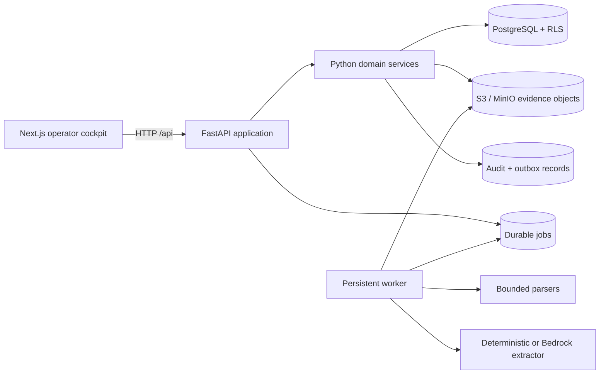

# FDLC Factory Engineer current-state audit

## Executive verdict

AI-FDE is a credible internal-alpha product foundation, not a prototype to replace. Its strongest asset is the enforced progression from source material to candidate inference, human-reviewed assertions, approved workflows, reproducible economics, and version-pinned implementation artifacts. The FastAPI/PostgreSQL modular monolith, separate worker, object-store boundary, row-level isolation, fail-closed production settings, and browser-local synthetic adapter are the correct base for Factory Engineer.

It is not production-ready today. The repository itself correctly describes the release as an “internal-alpha code candidate; synthetic-data only” ([README.md](../../README.md#current-status)). Live Auth0, AWS workload isolation, Bedrock evaluation, backup/restore, deletion, secret rotation, alerting, and rollback evidence remain unchecked external gates. Passing source tests does not satisfy those gates.

Several concepts in the target brief do not yet exist despite appearing in older narrative documentation: unresolved unknowns, a typed and versioned Customer Factory Model aggregate, general contradiction analysis, factory opportunities, FDLC readiness, factory lines, decisions, deployment packages, outcomes, field signals, connectors, Guide retrieval, and Mission Control integration. Telemetry records provider tokens and latency but not provider cost. The current “operating model” is a flat set of verified entities and assertions, not a versioned graph snapshot.

The recommended evolution is additive. Preserve existing public APIs and tables, clarify terminology, introduce explicit version aggregates and dependency records, and leave all governed execution state in Mission Control.

## Audit scope and evidence boundary

| System | Audit point | Role in this audit |
|---|---|---|
| AI-FDE | `801d4c12e14dd4510d40906d8aeddf357df6edce`, 2026-08-30 | Primary application and implementation base |
| FDLC | `40bee1863ba36d40f6c9b443c231f55beafbb5df`, 2026-09-03 | Public framework, lifecycle, protocol, and brand source |
| AI Software Factory Guide | repository state inspected 2026-09-04 | Canonical methodology, trust, autonomy, and terminology source |
| MissionControl | `07a96ac3623c8a6772455fcf4c9cdf4ca78e6d2f`, 2026-08-31 | Governed execution system of record |

The original AI-FDE checkout contained unrelated untracked conflict-copy files. The audit and implementation use an isolated worktree and branch, `codex/factory-engineer-evolution`, so those files remain untouched. FDLC and MissionControl also contained pre-existing untracked files; neither repository was modified.

## Product architecture as implemented



The application is a modular monolith with three deployable process types: Next.js web, FastAPI API, and a persistent Python worker. The API and worker share domain code and PostgreSQL rather than communicating through an internal service mesh. This is appropriately simple for the current maturity ([system architecture](../architecture/system-architecture.md)). Business logic remains server-side; the hosted demo is a deliberately separate browser adapter.

### Stack

- Python 3.13, FastAPI, Pydantic Settings, SQLAlchemy 2, PostgreSQL/pgvector, Alembic, psycopg, boto3, and pytest.
- Next.js 16.3, React 19.2, TypeScript 5.9, Tailwind CSS 4, Playwright, and axe-core.
- Local PostgreSQL and MinIO via Compose; production infrastructure is modeled as AWS Fargate, RDS, S3/KMS, Bedrock, Auth0, and Terraform.
- Six ordered Alembic migrations cover the vertical slice, workflows/economics/artifacts, OIDC sessions, data lifecycle, internal-alpha assessments, and readiness metadata.

## Trust path

The core chain is implemented and must remain the invariant around which new capabilities are built:

```text
Source evidence
  → bounded parsing and exact evidence segments
  → model-proposed candidate claims
  → human review decision
  → verified assertions and operating entities
  → approved current workflow
  → explicit Human / Software / AI allocation
  → approved target workflow
  → reproducible economic case
  → version-pinned seven-artifact packet
```

Material protections are real:

- An extracted claim is rejected unless its quoted text resolves to exact offsets in the stored segment ([knowledge/jobs.py](../../src/ai_fde/modules/knowledge/jobs.py#L128-L169)).
- Candidate claims remain `candidate` until a reviewer selects `accepted`, `rejected`, or `deferred`; only acceptance creates verified entities/assertions ([models.py](../../src/ai_fde/models.py#L352-L424)).
- Uploaded text is treated as untrusted input by the production extraction prompt and cannot alter system authority.
- Target workflow approval requires a still-approved current workflow; AI allocations require both rationale and controls ([workflows/service.py](../../src/ai_fde/modules/workflows/service.py#L273-L313)).
- Economics cannot be approved if its target workflow dependency is no longer approved ([economics/service.py](../../src/ai_fde/modules/economics/service.py#L274-L321)).
- Artifact generation requires approved current and target workflows plus an approved economic case with intact lineage ([artifacts/service.py](../../src/ai_fde/modules/artifacts/service.py#L205-L234)).

The naming needs tightening. Customer-uploaded material should become `SourceEvidence` or `EngagementEvidence` at the product/API layer. Mission Control uses `Evidence` for independently produced, acceptance-criterion-linked execution proof. Those are not the same thing.

## Persistence and domain model

The current schema has 24 durable model classes ([models.py](../../src/ai_fde/models.py)):

| Area | Current records | Assessment |
|---|---|---|
| Identity | `Operator`, `OIDCLoginAttempt`, `OperatorSession`, `EngagementMember` | Sound V1 abstraction; three coarse engagement roles |
| Engagement | `Engagement`, `EngagementAssessment`, export and deletion receipts | Durable and scoped; the single lifecycle field is presentation progress, not a sufficient future lifecycle model |
| Source evidence | `EvidenceAsset`, `EvidenceSegment`, `ExtractionRun` | Strong immutable provenance base; source types are only upload, operator note, and fixture |
| Claims | `CandidateClaim`, `ClaimEvidence`, `ReviewDecision`, `Contradiction` | Strong separation and exact citations; status and contradiction semantics are too narrow |
| Operating model | `OperatingEntity`, `Assertion`, `AssertionEvidence` | Useful relational graph primitives; no aggregate version, typed relations, explicit unknown, or assumption record |
| Workflows | `WorkflowVersion`, `WorkflowStep` | Current/target versions, approval and pins exist; graph/exception/time/cost semantics remain shallow |
| Economics | `EconomicCase` | Versioned, reproducible JSON inputs/outputs/scenarios; missing source references, model/compute cost, intervention/rework, confidence, and realized outcomes |
| Delivery | `ImplementationArtifact` | Seven version-pinned artifact types and content hashes; no package aggregate, approval, readiness gate, or MC handoff |
| Operations | `Job`, `OutboxEvent`, `AuditEvent` | Good durable primitives; outbox has no publisher and audit has no first-class timeline/decision UI |

All customer-domain records carry `engagement_id`. Migrations enable row-level security on engagement-scoped tables and the runtime role is configured without `BYPASSRLS`. Isolation tests exercise cross-engagement denial. Object keys are engagement-scoped and evidence content is deduplicated only within an engagement.

### Implemented state machines

| Record | States as implemented | Important limitation |
|---|---|---|
| Engagement progress | `qualify`, `discover`, `model`, `map`, `decide`, `design`, `economic_case`, `specify` | Mutated as a single forward progress label; cannot represent a portfolio of factory lines |
| Evidence asset | `queued`, `processing`, `needs_review`, `failed`, `complete` | No quarantine, superseded-source, connector freshness, or deletion state |
| Extraction run | `running`, `complete`, `failed` | Queue/lease/retry live on `Job`, so operational state is split across records |
| Candidate claim | `candidate`, `accepted`, `rejected`, `deferred` | Conflates support and human disposition; no stale/unknown/partial support axes |
| Assertion | `verified`, `superseded`, `disputed`, `retired` | Useful authoritative record, but not bound to an approved model version |
| Contradiction | `open`, `investigating`, `resolved`, `accepted_exception`, `not_a_conflict` | Detection only covers conflicting `REQUIRES_APPROVAL` claims for the same subject |
| Workflow | `draft`, `approved`, `stale` | Correct simple gate; approved immutability is enforced by services, not database triggers |
| Economic case | `draft`, `approved`, `stale` | Correct simple gate; latest reads may return stale records and require consumer care |
| Artifact | `current`, `stale` | Artifact rows are not grouped under an independently approved package aggregate |
| Job | `queued`, `running`, `completed`, `failed`, `cancelled` | Fixed lease; no lease heartbeat or explicit dead-letter state |
| Data deletion | engagement `active`, `deletion_processing`, `deletion_failed`; receipt `processing`, `completed`, `failed` | Strong fail-safe workflow, but future derived signals and MC references need explicit deletion semantics |

The target must not turn these into one larger enum. Engagement administration, FDLC readiness, factory-line lifecycle, package lifecycle, and Mission Control execution are independent dimensions.

## API surface

The current API is intentionally unversioned under `/api`. Its routes are cohesive and should remain compatible while new resources are added ([routes.py](../../src/ai_fde/api/routes.py)):

| Resource | Current operations |
|---|---|
| Health and identity | health, OIDC login/callback/logout, current operator |
| Engagements | create, list, workspace detail |
| Evaluation | internal-alpha scorecard, engagement delivery scorecard, assessment list/upsert |
| Data lifecycle | lifecycle detail, retention update, export, deletion, deletion receipt |
| Source evidence | upload, operator note, list |
| Claims | list and human review |
| Operating model | verified entities/assertions read model |
| Contradictions | list and explicit resolution |
| Workflows | current/target read, construct/design, edit step, approve |
| Economics | current read, calculate, approve |
| Artifacts | list, generate seven-artifact packet, implementation-spec read |

The safest API evolution is additive: retain these routes, introduce new engagement-scoped nouns, add explicit `schema_version` fields to portable contracts, and use compatibility adapters when internal terminology changes. A wholesale `/api/v1` rewrite would create migration work without improving the current trust model.

## Evidence ingestion, worker, and model provider

### What is strong

- Supported bounded parsers cover plain text, Markdown, CSV, EML, PDF, DOCX, PNG, and JPEG.
- Evidence objects are hashed, stored behind an `EvidenceStore` abstraction, and referenced by engagement-scoped storage keys.
- Jobs are durable and idempotent per engagement; `SELECT ... FOR UPDATE SKIP LOCKED` prevents competing workers from leasing the same job ([knowledge/jobs.py](../../src/ai_fde/modules/knowledge/jobs.py#L34-L59)).
- Failures are converted to bounded public messages, retried with exponential backoff, and recorded without raw customer content ([worker.py](../../src/ai_fde/worker.py#L40-L69)).
- Production uses Bedrock with constrained structured output. Deterministic extraction remains available for development and synthetic fixtures.

### What needs extension

- Only one job kind, `ingest_evidence`, is supported.
- The fixed worker lease has no renewal loop. Configuration requires the lease to exceed the Bedrock read timeout by 30 seconds, reducing but not eliminating long-running-job risk ([config.py](../../src/ai_fde/config.py#L66-L76)).
- Retry exhaustion becomes `failed`; there is no explicit dead-letter and re-drive workflow.
- Connector sync identity, cursor, consent, permission scopes, revocation, freshness, and per-item source versions do not exist.
- Extraction telemetry stores provider, model, prompt/schema versions, input/output tokens, latency, and result code, but no billed cost or pricing-version record.

## Identity, authority, and isolation

Development identity and production OIDC are deliberately separate. OIDC uses authorization code plus PKCE/state/nonce, server-side opaque session tokens stored only as digests, an operator allowlist, expiry/revocation, and HTTP-only cookies. Production rejects development identity, requires HTTPS origins, a dedicated service operator, Bedrock, regional S3 with workload identity, and a recorded validation ID before sanitized data can be enabled ([config.py](../../src/ai_fde/config.py#L60-L122)).

Engagement authorization uses `owner`, `operator`, and `viewer`. This is adequate for the internal alpha. Future observation, recommendation, configuration, execution-invocation, publication, and production authorities must be modeled as separate grants rather than overloaded into these roles or an autonomy level.

## Versioning and staleness

The current broad invalidation is safe:

- accepted model change → all draft/approved workflows stale → economics and artifacts stale;
- current workflow change → target workflows, economics, and artifacts stale;
- target workflow change → economics and artifacts stale;
- economics change → current artifacts stale.

This is implemented as explicit SQL updates ([lifecycle.py](../../src/ai_fde/modules/lifecycle.py)). It prevents silent reuse but is deliberately blunt. Selective invalidation requires an explicit `ArtifactDependency` graph with source identity, source version/digest, dependency reason, materiality, and invalidation policy. Do not optimize this until those dependencies are persisted and tested.

## Economics

The economic engine is deterministic and versioned under `labor-capacity-sensitivity-v2`. It requires annual volume, current and target minutes, loaded labor cost, implementation cost, and annual operating cost with a classification for every input. Low/base/high cases are reproducible transformations, and outputs expose their formulas ([economics/service.py](../../src/ai_fde/modules/economics/service.py#L15-L24), [economics/service.py](../../src/ai_fde/modules/economics/service.py#L169-L270)).

This is reusable, but it currently measures projected labor capacity only. Factory Engineer needs optional per-line measures for error/rework, human intervention, compute/model cost, cost per verified outcome, baseline period, evidence references, uncertainty, observation windows, and realized values. Missing evidence must remain “insufficient,” never zero. Cost per Verified Software Outcome is valuable only where “verified outcome” can be defined consistently.

## Seven-artifact packet

Current artifact types are:

1. PRD
2. Architecture
3. Business rules
4. Integration requirements
5. Approval controls
6. Evaluation plan
7. Implementation specification

Each artifact has a content hash, packet/version number, and pins to approved current workflow, target workflow, economic case, and assertion IDs ([models.py](../../src/ai_fde/models.py#L640-L681)). This is a strong compatibility layer. Do not replace it with an arbitrary 13-document packet.

The target should wrap these rows in an immutable `FactoryDeploymentPackageVersion`, retain them as seven generated views, and add distinct structured contracts only where they govern something new: verified customer context, readiness result, authority/policy matrix, verification contract, deployment/rollback/observability requirements, and Mission Control Plan input.

## Telemetry, audit, and evaluation

Implemented telemetry includes metadata-only HTTP access logs, extraction provider/model/prompt/schema identity, tokens, latency, result codes, persistent audit events, outbox events, delivery assessments, and internal-alpha rollups. The objective scorecard covers profile/packet completeness, claim disposition, contradiction closure, provider usage, duration, usefulness, clarification, rework, workarounds, and trust failures.

Gaps:

- No outbox publisher or external telemetry exporter is implemented.
- No tool-call, deployment, decision, outcome, or provider-cost telemetry exists.
- Audit events are not yet exposed as an engagement timeline or structured decision log.
- The scorecard blocks comparative claims until three workflows per method, which is good, but no conventional cohort exists.
- The evaluation suite has no labeled corpora for claim grounding, contradiction precision/recall, workflow extraction, opportunity ranking, or readiness blocker recall.

## Operator experience

The UI is a polished single engagement cockpit with accessible landmarks, keyboard-operable disclosures, loading/empty/error/success/stale states, responsive layout, and nine current sections:

1. Evidence
2. Claim review
3. Verified model
4. Current workflow
5. Target workflow
6. Economics
7. Specification
8. Delivery proof
9. Data lifecycle

The dense workspace identity is worth preserving. The main maintainability issue is component size: the engagement cockpit and lifecycle workspace concentrate many concerns in very large client components. This does not justify a redesign, but new target sections should use focused route-level/workspace modules rather than extending the same files indefinitely.

## Hosted synthetic demo

The source adapter is valuable and safe by design:

- compile-time `NEXT_PUBLIC_AI_FDE_HOSTED_DEMO=true` selects a browser-local adapter before any fetch;
- state is deterministic and stored in local storage;
- fixtures are explicitly synthetic;
- no identity, customer upload, live database, worker, cloud object store, or model call is used;
- an invalid API URL provides defense in depth against fallthrough.

Production observation on 2026-09-04 exposed a deployment-process weakness. The public alias first served a build that attempted `GET http://localhost:8000/api/auth/me`; the golden-path test failed because no synthetic engagements loaded. Minutes later the same alias served different immutable chunks with the correct browser-local adapter; the internal-alpha test, accessibility suite, a refreshed browser session, and a repeated golden path passed. No repository change by this audit caused that switch.

The source is sound; the release process is not deterministic enough. Vercel demo builds depend on command-line `--build-env` flags documented in the README rather than a build-time invariant. A public-demo build must fail if demo mode or the invalid fallback URL is absent, and post-deploy golden/a11y tests must gate alias promotion.

The accompanying Phase 1 change adds that build-time invariant. It does not deploy or otherwise mutate the public alias; a release smoke gate remains follow-on work.

The three existing fixtures—accounts payable, employee access onboarding, and support triage—prove different workflow shapes but not modernization, security remediation, or test engineering factory lines. Preserve them and add those three engineering cases later.

## Verification performed

| Check | Result on audit commit |
|---|---|
| `ruff check .` | Passed |
| `mypy src tests` | Passed, 63 source files |
| Alembic `upgrade head` and `check` against local PostgreSQL | Passed; no pending operations |
| `pytest` with PostgreSQL and MinIO running | 47 passed; one upstream Starlette/httpx deprecation warning |
| Frontend TypeScript | Passed |
| Frontend ESLint | Passed with zero warnings |
| Exact `next build` | Blocked by the execution sandbox when Turbopack attempted to create a process/bind a port; this is an audit-environment limitation, not a source failure |
| Public golden path, first observation | Failed while the alias served a build configured to call localhost |
| Public internal-alpha rehearsal | Passed, 1 test |
| Public accessibility suite | Passed, 5 tests |
| Public golden path, repeated after alias changed | Passed, 1 test |

The Python test suite initially reported 30 passed and 17 skipped because PostgreSQL was unavailable. After starting the repository’s PostgreSQL and MinIO services and applying migrations, all 47 tests ran and passed. This distinction matters: the database isolation tests are not optional evidence.

## Production-readiness assessment

### Implemented and reusable now

- Evidence/inference/human-approval separation.
- Exact provenance and engagement-scoped storage.
- PostgreSQL persistence, migrations, RLS, and isolation tests.
- Versioned current/target workflows and deterministic economics.
- Version-pinned seven-artifact packet.
- Persistent job leasing/retry and service identity abstraction.
- OIDC/session design and fail-closed configuration.
- Synthetic demo adapter and browser acceptance/accessibility tests.
- Export/deletion workflow and bounded telemetry.

### Implemented architecture but not production-qualified

- Auth0/OIDC against a live tenant.
- AWS Fargate/RDS/S3/KMS deployment and rollback.
- Bedrock extraction with the exact production model.
- Workload identity and least-privilege cloud denial tests.
- Backup restore, deletion completion, retention, and secret rotation.
- Alerting, operational ownership, and first-72-hour support.

### Missing product capabilities

- Customer Factory Model versions and typed engineering estate.
- Orthogonal claim-support, human-disposition, and freshness states.
- General contradictions, explicit unknowns/assumptions, and evidence freshness.
- Structured interviews and read-only connectors.
- Factory opportunity assessment/portfolio and Factory Designer.
- Evidence-backed FDLC readiness and waivers.
- Deployment package aggregate, readiness gate, and Mission Control contract.
- Deployment projections, outcomes, engagement timeline, decisions, and field signals.
- Curated Guide links and cited “Ask the Customer Model.”
- Capability-candidate library and privacy-reviewed productization.

## Implementation hazards found in source review

These are bounded defects or hardening gaps, not reasons to replace the architecture:

- **Upload buffering:** the API reads an entire upload before the service applies its 5 MiB check. Enforce request/body size at the proxy and streaming application boundary before customer data.
- **Provider fan-out:** one extraction request is made per parsed segment. A maximum-size CSV can yield thousands of model calls inside one job. Add segment/call/token/cost budgets and resumable batching.
- **Object/transaction ordering:** evidence object storage occurs before the database transaction commits, so a later database failure can orphan an object. Add reconciliation or a staged-finalize protocol.
- **Lease fencing:** jobs store a lease token, but completion/failure does not validate token ownership and no heartbeat exists. A reclaimed job can race an old worker. Add fenced transitions and renewal before expanding job types.
- **Review terminality:** only `candidate` claims can be reviewed; `deferred` cannot return to review and accepted claims have no correction/supersession command. Evidence assets also remain `needs_review` after every claim has been decided.
- **Contradiction resolution:** `superseded` and `override` close the blocker without identifying the authoritative winner or updating dependent assertions.
- **Multi-source projection:** the schema allows several assertion-evidence links, but the operating-model read shape exposes a singular evidence field and can duplicate assertion rows.
- **Approval separation:** the same generic operator may propose and approve workflows/economics. Service code prevents edits after approval, but database grants do not make approved rows append-only.
- **Stale latest reads:** several `get_latest` helpers return the highest version even when stale. A Mission Control consumer must never use these convenience reads.
- **Audit/outbox durability:** audit rows are not database-enforced append-only, correlation IDs are independently generated rather than propagated, and the outbox has no delivery worker, attempts, cursor or dead-letter behavior.
- **Scorecard recovery:** a successfully retried job leaves its historical failed `ExtractionRun`; the scorecard’s “all runs complete” rule can therefore remain false after recovery.
- **Health/readiness:** `/api/health` is static and does not check database, object store, migration revision, worker heartbeat or queue age.
- **Readiness attestations:** external Auth0/restore/deletion/rotation evidence is represented by non-empty identifier strings rather than cryptographically or API-verifiable receipts.
- **Contract drift:** the hosted demo contains enum values that the backend schema would reject (`evidence_review`, `context`, `process`, `is_a`, `verified_relationship`). It is a simulation, but a shared fixture/contract test is needed.
- **RLS reference integrity:** engagement RLS is tested, but cross-table foreign keys do not all include `engagement_id`; add composite constraints or equivalent database enforcement as new aggregates land.
- **CI:** there is no checked-in workflow, and plain `pytest` silently skips database trust tests when PostgreSQL is absent. CI must treat those skips as a failure.

## Priority risks

| Priority | Risk | Required response |
|---|---|---|
| P0 | A public demo can be built in production-service mode and call localhost | Add a Vercel build invariant and gate alias promotion on deployed tests |
| P0 | Narrative could overstate production readiness | Keep source capability, external qualification, and customer proof as separate labels |
| P0 | New features could blur source evidence with MC verification evidence | Adopt explicit terminology and storage/API boundaries before schema expansion |
| P0 | Factory Engineer could duplicate MC execution state | Restrict the first integration to immutable package export and read-only projections |
| P0 | One evidence job can fan out into unbounded provider calls | Add explicit per-job segment, call, token, time and cost budgets before customer evidence |
| P0 | Lease completion is not fenced to the active lease token | Add token-checked completion/failure and heartbeat before increasing worker concurrency |
| P1 | One engagement lifecycle cannot represent multiple factory lines | Model engagement administration and factory-line lifecycle separately |
| P1 | Claim status cannot represent partial support, staleness, or unknowns cleanly | Introduce orthogonal state axes and migrate compatibly |
| P1 | Broad staleness cannot explain impact | Persist dependencies before making invalidation selective |
| P1 | Cross-customer learning can leak confidential context | Keep signals local until generalized, de-identified, reviewed, and explicitly promoted |
| P2 | Large client components will become change hotspots | Add focused modules/routes as capabilities arrive; defer broad UI refactor |
| P2 | Provider token metrics can be mistaken for cost | Add pricing-versioned cost records or label cost unavailable |

## Audit conclusion

The right move is evolution, not reconstruction. The existing vertical slice already proves the hardest product principle: AI proposals do not become authoritative customer truth without exact evidence and a human decision. Factory Engineer should broaden the modeled customer reality, add FDLC readiness and factory-line design around that core, package approved intent for Mission Control, and close the learning loop—without absorbing Mission Control’s execution responsibilities or FDLC Enterprise’s proposed organization-wide control plane.
