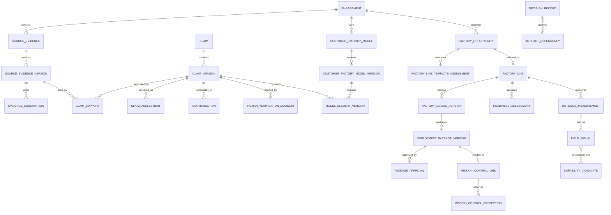

# Factory Engineer target domain model

## Modeling rules

1. Stable identity and immutable version are separate records.
2. Every customer-owned record carries `engagement_id`; every reference is checked to remain in the same engagement.
3. Source material, inference, human decision, approved truth, execution intent, execution proof, and outcome are distinct record classes.
4. Approved versions are immutable. A change creates a new draft/version and a new decision.
5. Lifecycle, health, freshness, and human disposition are separate axes when they answer different questions.
6. Consequential derived records pin exact upstream IDs, versions, and digests—never “latest.”
7. A reference to Mission Control is a projection/link, not a second execution aggregate.

Notation rule: every customer-scoped record below physically stores `engagement_id`, even where a compact field list omits the repeated column. Parent references use composite `(engagement_id, parent_id)` foreign keys, and uniqueness constraints include the engagement where applicable. `GeneralizedSignal` and `CapabilityCandidate` are deliberately outside the customer boundary and may consume only privacy-reviewed, de-identified signal references—not customer records or source content.

## Aggregate map



## Existing-to-target mapping

| Existing record | Target relationship | Migration rule |
|---|---|---|
| `Engagement` | Stable engagement shell | Preserve ID and existing routes; add administration status separately from progress projection |
| `EvidenceAsset` | Initial `SourceEvidenceVersion` storage record | Keep table/internal name first; expose product alias before physical rename |
| `EvidenceSegment` | Source locator/content unit | Preserve exact offsets and parser identity |
| `ExtractionRun` | Specialist run for source processing | Preserve and generalize telemetry after budgets/lease hardening |
| `CandidateClaim` | Stable `Claim` plus initial immutable `ClaimVersion` | Backfill model confidence and orthogonal state views without rewriting history |
| `ClaimEvidence` | `ClaimSupport` with `SUPPORTS` polarity | Preserve exact citation; add polarity/quality/freshness |
| `ReviewDecision` | `HumanVerificationDecision` | Preserve immutable decision; introduce correction/supersession rather than update |
| `OperatingEntity` + `Assertion` | Materialized approved model elements | Retain as current compatibility projection from approved Customer Factory Model version |
| `WorkflowVersion` | `WorkflowVersion` pinned by customer model/factory design | Preserve current/target records; extend graph additively |
| `EconomicCase` | `EconomicCaseVersion` | Preserve formula engine and data; add evidence/observation links |
| `ImplementationArtifact` | Artifact views within package version | Preserve all seven types and hashes |
| `AuditEvent` | Timeline source | Keep immutable event; project user-facing timeline |
| `OutboxEvent` | Integration delivery source | Extend and implement publisher before relying on it |

## Engagement

The engagement is the customer-scoped administrative and isolation boundary, not the factory-line lifecycle.

```text
Engagement
  id, customer_ref, name, objective, primary_workflow
  administration_status, data_classification
  created_by, created_at, closed_at, archived_at
```

Administration states:

`DRAFT → ACTIVE ↔ PAUSED → CLOSED → ARCHIVED`

Closure requires explicit handling of active Mission Control links, outstanding retention/legal holds, export, derived field signals, and remaining customer data. Duplicate customer names are valid; identity is the stable ID/external reference.

## Source evidence

Use `SourceEvidence` or `EngagementEvidence` in public language. Reserve unqualified Mission Control `Evidence` for verifier-produced execution receipts.

```text
SourceEvidence
  id, engagement_id, logical_source_type, external_source_ref

SourceEvidenceVersion
  id, source_evidence_id, version, content_hash, storage_ref
  content_type, byte_count, observed_at, acquired_at
  connector_installation_id?, external_version?, freshness_status
  provenance, classification, processing_status
```

Processing states:

`RECEIVED → PROCESSING → USABLE | FAILED | QUARANTINED → SUPERSEDED | DELETED`

`freshness_status` is separate: `CURRENT | AGING | STALE | UNKNOWN`.

Duplicate bytes within an engagement may resolve to an existing version, but a new external source version or observation timestamp must not be lost. Connector revocation stops future acquisition and may stale derived claims; it does not rewrite history.

## Claims, support, and human verification

A single status cannot safely represent inference strength, human authority, and freshness. Model these independently:

```text
Claim
  id, engagement_id, canonical_key, created_at, retired_at?

ClaimVersion
  id, engagement_id, claim_id, version
  subject_ref, predicate, object_ref_or_value, statement
  category, materiality, impact, owner, content_digest
  proposed_by, created_at

ClaimAssessment
  id, engagement_id, claim_version_id, assessment_version, specialist/version
  support_state, model_confidence, rationale, assessed_at

ClaimSupport
  id, engagement_id, claim_version_id, source_evidence_version_id, segment_id
  polarity, exact_quote, offsets, locator
  source_quality, observed_at, freshness

HumanVerificationDecision
  id, engagement_id, claim_version_id, claim_assessment_version
  disposition, reason, decided_by, decided_at
  authority_basis, supersedes_decision_id?
```

Axes:

- support: `CANDIDATE | SUPPORTED | PARTIALLY_SUPPORTED | CONTRADICTED | UNKNOWN`;
- human disposition: `PENDING | VERIFIED | REJECTED | DEFERRED | ACCEPTED_WITH_EXCEPTION`;
- freshness: `CURRENT | STALE`;
- materiality/impact: separate fields, not statuses.

Model confidence is provider/model/version-specific advisory metadata. It never sets human disposition. A model may propose support state; it cannot mark a claim human-verified.

Any edit to a claim’s subject, predicate, object/value, statement, category, materiality, impact, or owner creates a new immutable `ClaimVersion` with a new digest. Support, assessments, contradictions, verification decisions, and model elements pin that exact version. A verification decision never follows automatically to a later version.

`ClaimSupport.polarity` is `SUPPORTS | CONTRADICTS | CONTEXT`. Multiple sources can corroborate or disagree. “No contradiction detected” means only that configured detectors found none in the processed evidence.

### Unknowns, contradictions, and assumptions

```text
Unknown
  id, engagement_id, question, category, materiality
  owner, blocking, status, due_at, resolution_claim_version_id?

Contradiction
  id, engagement_id, claim_version_refs[], scope, temporal_context
  detector/version, summary, impact, blocking, status
  resolution_decision_id?, resolved_claim_version_refs[]

Assumption
  id, engagement_id, statement, scope, owner
  confidence, source_evidence_version_refs[], claim_version_refs[]
  status, expires_at
  approval_ref?, dependent_artifact_refs[]
```

Unknown: `OPEN → INVESTIGATING → RESOLVED | ACCEPTED_RISK | NOT_APPLICABLE`.

Contradiction: `OPEN → INVESTIGATING → RESOLVED | ACCEPTED_EXCEPTION | NOT_A_CONFLICT`.

Assumption: `PROPOSED → ACCEPTED | REJECTED → EXPIRED | SUPERSEDED`.

Resolution must identify what becomes authoritative, why, under what scope/time, and which dependent records stale. Majority vote is not a resolution.

## Customer Factory Model

`CustomerFactoryModel` is a stable aggregate. `CustomerFactoryModelVersion` is the immutable approved snapshot.

```text
CustomerFactoryModel
  id, engagement_id, name

CustomerFactoryModelVersion
  id, model_id, version, status, schema_version
  source_claim_decision_refs[], content_digest
  proposed_by, approved_by?, approved_at?

ModelElementVersion
  model_version_id, stable_element_id, element_type
  properties, valid_from?, valid_until?, source_claim_version_refs[]

ModelRelationVersion
  model_version_id, stable_relation_id, subject_id
  relation_type, object_id/value, properties, source_claim_version_refs[]
```

Version states: `DRAFT → IN_REVIEW → APPROVED → SUPERSEDED`, plus independent freshness `CURRENT | STALE`.

Target element types include organization, team, person, role, decision authority, repository, service, application, dependency, environment, source control, work system, CI, CD, testing, security, observability, incident system, service catalog, policy, constraint, risk, workflow, and baseline. Start with types needed by the first engineering fixtures; do not build the full ontology at once.

Every material property and relation carries one or more verified claim references or an explicit approved assumption. The current `OperatingEntity`/`Assertion` endpoint remains a flattened compatibility view.

## Workflows and factory design

Preserve current/target workflow versions, then add graph semantics:

```text
WorkflowVersion
  stable_workflow_id, version, kind=CURRENT|TARGET
  customer_model_version_id, status, freshness, digest

WorkflowNode
  id, type, name, actor/system, inputs, outputs
  duration, queue_time, cost, failure/rework properties
  allocation, source_refs[]

WorkflowEdge
  from_node, to_node, condition, exception, source_refs[]
```

Factory-design step types use `HUMAN`, `DETERMINISTIC_SOFTWARE`, `AGENT`, `VERIFIER`, `APPROVAL`, and `SYSTEM_EVENT`. Each agent step may specify capability requirements, model requirements, tools, MCP servers, skills, context contract, permissions, retry/timeout, sandbox requirement, independent verification, fallback, and escalation. MCP requirements carry semantic identity, protocol/version, scopes, data boundary, and trust state; they do not imply Mission Control has authorized the server. These are requirements, not claims that a certified capability exists.

`FactoryDesignVersion` pins target workflow, opportunity, authority matrix, verification contract, environment, rollback, observability, economics, and customer-model versions. Mission Control later resolves semantic requirements to its current local Factory Definition Version and policy.

## Factory opportunity and factory line

```text
FactoryOpportunity
  id, engagement_id, title, workflow_ref, problem_statement
  eligibility_results[], dimension_assessments[]
  value_band, verifiability_band, risk_band, readiness_band
  evidence_refs[], assumptions[], explanation
  status, proposed_by, assessed_by?

FactoryLine
  id, engagement_id, opportunity_id, owner, objective
  lifecycle_state, operational_health
  autonomy_level, risk, selected_design_version_id?
  deployment_package_id?, mission_control_link_id?

FactoryLineTemplateAssessment
  id, engagement_id, opportunity_id, template_ref, template_version
  fit_band, rationale, mismatch_refs[]
  required_customizations[], required_validations[]
  customer_local_extensions[], assessed_by, assessed_at
```

Opportunity states: `CANDIDATE → ASSESSED → SELECTED | REJECTED | DEFERRED`.

Factory line states:

`CANDIDATE → ASSESSED → SELECTED → DESIGNING → VALIDATING → APPROVED → DEPLOYMENT_READY → DEPLOYING → ACTIVE ↔ PAUSED → RETIRED`

Health is separate: `UNKNOWN | HEALTHY | DEGRADED | FAILED`. FDLC stage readiness is also separate. An active line can be degraded without changing lifecycle stage.

Opportunity dimensions are ordinal and evidence-backed. Do not persist a 0–100 overall score until calibrated against expert decisions. Hard eligibility failures block ranking.

A template assessment is advisory and version-pinned. It cannot replace customer source evidence, auto-select an opportunity, or imply that referenced agents, tools, skills, MCP servers, policies, or observability packs are locally available. Customer-specific extensions remain engagement-scoped unless separately generalized and privacy-reviewed.

## Readiness

```text
ReadinessAssessment
  id, factory_line_id, version, assessed_design_version_id
  overall_status, assessed_at, assessor

ReadinessStageResult
  assessment_id, stage
  status, evidence_refs[], blocker_refs[], decision_refs[]
  required_artifact_refs[], owner, next_action

ReadinessGateResult
  gate_key, result, severity, waivable, evidence_refs[]

ReadinessWaiver
  gate_key, scope, reason, impact, approved_by
  evidence_refs[], issued_at, expires_at
```

Stages are the canonical FDLC lifecycle: Discover, Design, Assemble, Validate, Deploy, Operate, Improve. Status is `NOT_ASSESSED | BLOCKED | IN_PROGRESS | READY | NOT_APPLICABLE`. Gate result is `PASS | FAIL | UNKNOWN | WAIVED | NOT_APPLICABLE`.

Package readiness is `READY` only when all required gates pass or have valid waivers. Missing evidence is `UNKNOWN`, not pass. Material source contradictions, authority ambiguity, missing independent verification, and absent rollback are fail-closed; some authority/security gates are non-waivable.

## Decision record

```text
DecisionRecord
  id, engagement_id, decision_type, subject_ref, version
  decision, alternatives[], rationale, evidence_refs[]
  policy_ref?, proposed_by, authorized_by, decided_at
  scope, expires_at?, supersedes_id?, dependent_artifact_refs[]
```

Use for claim verification, opportunity selection, human/agent allocation, autonomy, capability/model choice, verification approach, policy exception, readiness waiver, package approval, and outcome acceptance. Proposer, authorizer, executor, validator, and acceptor remain distinct role references even if a low-risk policy allows one person to hold multiple roles.

## Deployment package

`FactoryDeploymentPackage` is the stable identity; `FactoryDeploymentPackageVersion` is immutable.

States:

`DRAFT → GATE_BLOCKED | READY → IN_REVIEW → APPROVED → EXPORTED → SUPERSEDED`

Freshness remains `CURRENT | STALE`. Mission Control acceptance/rejection belongs to `MissionControlLink.handoff_status`, not package lifecycle. An approved package is never edited. Regeneration, rejection response, changed upstream evidence, or changed policy creates a new version and approval.

The version pins customer-model, current workflow, target workflow, factory design, readiness, economics, acceptance criteria, verification, decision, and seven-artifact versions. It carries a canonical digest and the contract in [mission-control-integration-contract.md](mission-control-integration-contract.md).

## Mission Control link and projection

```text
MissionControlLink
  engagement_id, issuer_id, package_id, package_version, package_digest
  target_instance_ref, workspace_ref, mission_ref?, plan_ref?
  handoff_status, idempotency_key, created_at, last_reconciled_at

MissionControlProjection
  link_id, source_revision, event_id/cursor, observed_at
  mission_state, verified, accepted, merged, released, production_verified
  work_order_refs[], verification_evidence_refs[], failure_class?, metric_refs[]
```

Handoff status: `NOT_SENT → SUBMITTING → ACCEPTED | REJECTED | SYNC_DEGRADED → CLOSED`.

Only one link/import receipt may exist for `(issuer_id, package_id, package_version)` in a target Mission Control instance. The stored digest is part of the receipt, not the uniqueness key: an identical retry returns that receipt, while a different digest for the same issuer/ID/version is an integrity conflict.

Events may be duplicate, delayed, missing, or out of order. Apply only newer source revisions, deduplicate event IDs, retain last successful cursor, and reconcile periodically. Factory Engineer never infers acceptance from Attempt completion.

## Outcomes

```text
OutcomeMetricDefinition
  key, name, unit, measurement_method, verification_rule

OutcomeMeasurement
  factory_line_id, metric_definition_id, classification
  value, currency?, source_ref, collection_window
  baseline_version?, design_version?, deployment_version?
  quality_classification, attribution_confidence, recorded_by, recorded_at
```

Classification is `BASELINE | PROJECTED | MEASURED | REALIZED`. Quality classification distinguishes direct measurement, calculation, estimate, assumption, synthetic, and simulation. Attribution confidence is independent from the value and must not imply causation. Handle seasonality, partial rollout, rollback, mixed deployed versions, and insufficient observation time explicitly.

Recommended metrics are selected per line: autonomous completion, human intervention, first-pass verification, cycle time, compute/model cost, human time, rollback, rework, escaped defects, policy failures, recovery, and cost per verified software outcome. The last metric is used only where the outcome and verification denominator are stable.

## Field signals and capability candidates

```text
FieldSignal
  id, engagement_id, category, normalized_pattern_key
  customer_local_description, impact, confidence
  evidence_refs[], outcome_refs[], status
  customer_specific, reusable_candidate, reviewed_by?

GeneralizedSignal
  id, pattern_key, generalized_description, aggregate_count
  contributing_signal_refs[], privacy_review_id, steward_decision_id

CapabilityCandidate
  id, version, generalized_signal_refs[], capability_type
  applicability, dependencies, permissions, risk
  evidence_summary, required_evals, candidate_status
  authoritative_registry_ref?
```

Field signal states: `OBSERVED → REPEATED → CANDIDATE → VALIDATED → PRODUCTIZED | REJECTED`.

Raw text, exact citations, repository identifiers, customer configuration, and evidence objects never cross engagement boundaries. Cross-customer aggregation runs only on explicitly generalized metadata after privacy and product-steward review. A useful initial threshold may be three distinct engagements, but that is a product/privacy decision—not an implementation default. `PRODUCTIZED` requires an authoritative Agent Factory/capability-steward reference; Factory Engineer cannot self-certify.

## Dependency and staleness model

```text
ArtifactDependency
  engagement_id, source_type, source_id, source_version, source_digest
  dependent_type, dependent_id, dependent_version
  dependency_reason, materiality, invalidation_policy
```

On an upstream change:

1. append an upstream version/decision;
2. traverse explicit dependencies;
3. mark affected versions stale with cause and impact;
4. notify owners and expose a change-impact view;
5. require regeneration/reapproval where policy says so;
6. if exported to MC, notify the linked integration and request a policy decision;
7. never silently cancel or continue MC execution.

Conservative broad invalidation remains in place until the dependency graph is complete and parity-tested.

## Deletion and retention invariants

- Deletion during processing cancels or fences jobs before database/object removal.
- Approved historical records cannot retain dangling source content without an explicit tombstone and policy-approved audit minimum.
- Active Mission Control links must be closed or explicitly orphaned before deletion completes.
- Generalized field signals must be provably free of customer content; otherwise delete them with the engagement.
- Export includes every new aggregate and schema version before the matching delete path ships.
- Cache keys, retrieval indexes, logs, traces, object stores, backups, and outbox payloads are part of the data inventory.
