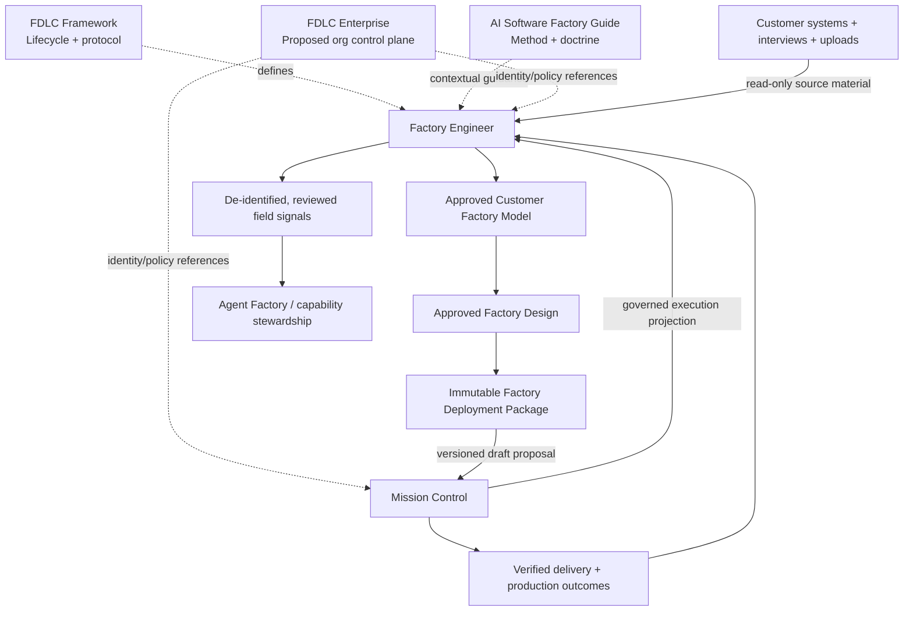

# FDLC Factory Engineer target product architecture

## Architecture decision

Evolve AI-FDE into an independently deployable FDLC product on the existing FastAPI/PostgreSQL foundation. Factory Engineer owns evidence-backed customer understanding, factory-line opportunity/design/readiness, approved deployment intent, and field learning. It does not become an execution engine, an enterprise control plane, or a copy of the Guide.

The architecture is a set of stable ownership boundaries connected by versioned contracts:



## Ecosystem ownership

| Product | Owns | Explicitly does not own |
|---|---|---|
| FDLC Framework | `Discover → Design → Assemble → Validate → Deploy → Operate → Improve`; continuous Govern/Secure/Observe/Measure; protocol vocabulary | Customer records, application runtime, execution truth |
| AI Software Factory Guide | Canonical methodology, trust doctrine, autonomy L0–L5, architecture guidance and deep links | Customer evidence, approvals, runtime policy, live product state |
| Factory Engineer | Engagements, source evidence, claims, Customer Factory Model, current/target workflows, opportunities, factory designs, readiness, economics, package approvals, MC linkage, outcomes, field signals | WorkOrders, Attempts, leases, sandboxes, execution evidence, gate/acceptance/release authority |
| Mission Control | Mission/Plan/WorkOrder/Task/Attempt truth; runtime Factory Definition Version; leases, sandboxes, execution, independent verification, approvals, releases, recovery | Customer discovery, source claims, economic business case, FE readiness |
| FDLC Enterprise | Proposed organization-level tenancy, identity, policy, fleet/portfolio governance, cross-team visibility and enterprise analytics | V1 dependency; it is not implemented today |
| Agent Factory / capability steward | Author, evaluate, certify, publish, deprecate and revoke reusable agents/skills/tools/policies | Customer-local source evidence or automatic productization |

### Boundary rules

1. Authority flows down through explicit contracts; evidence and outcomes flow back.
2. Upstream approval is provenance, never downstream execution authorization.
3. Factory Engineer may create a Mission and Plan **draft** through a governed importer. It may not submit, approve, dispatch, accept, merge, release, or deploy on the customer’s behalf.
4. Mission Control records are linked or projected, not mirrored into parallel mutable state machines.
5. FDLC Enterprise remains an optional future provider of organization/policy references. Factory Engineer retains its current identity/isolation until a real Enterprise contract exists.
6. Public Guide content is advisory context, never customer evidence or executable authority.

## Canonical lifecycle model

Do not create one universal `phase` enum. Five models answer different questions:

| Lifecycle | Question | Owner |
|---|---|---|
| FDLC program lifecycle | How mature is development/deployment of this factory line? | Framework semantics, FE assessment |
| Factory Engineer engagement administration | Is the customer engagement active, paused, closed, or archived? | Factory Engineer |
| Factory line lifecycle | Where is this specific candidate/deployment in its life? | Factory Engineer, with MC projections during deployment |
| AI Software Factory value stream | How does software work move from intent through delivery? | Guide doctrine; MC implementation |
| Mission/WorkOrder/Attempt/release states | What is authorized and happening in governed execution? | Mission Control only |

An engagement’s dashboard “phase” is a derived progress/readiness projection. It must not be a mutable wizard step, and a single engagement may contain factory lines at different stages.

## Target Factory Engineer runtime

Retain the modular monolith and add bounded modules around existing services:

```text
src/ai_fde/modules/
  engagements/             existing; administration and portfolio shell
  evidence/                existing; product term becomes Source Evidence
  knowledge/               existing extraction, claims, contradictions
  customer_model/          aggregate versions and typed engineering estate
  workflows/               existing current/target versions, later graph depth
  opportunities/           eligibility and explainable ordinal assessments
  factory_lines/           long-lived opportunity/design/deployment unit
  readiness/               FDLC stage gates, blockers, waivers
  economics/               existing formula engine plus baseline/outcomes
  decisions/               consequential human records
  artifacts/               existing seven renderers
  deployment_packages/     immutable approved package aggregate/export
  mission_control/         contract validation, draft handoff, read projection
  outcomes/                baseline/projected/measured/realized observations
  field_signals/           local observations and reviewed generalization
  guide/                   curated links, later bounded advisory retrieval
  lifecycle.py             conservative invalidation until dependency graph lands
```

Do not add internal microservices or a new graph database. PostgreSQL relational tables plus explicit relation/dependency records match the current trust and transaction requirements. Add process separation only if customer data boundaries, operational scaling, or independent failure domains demand it.

## Product workflow

```mermaid
flowchart LR
    A[Create engagement] --> B[Acquire source evidence]
    B --> C[Propose claims]
    C --> D[Human review]
    D --> E[Approve Customer Factory Model version]
    E --> F[Approve current workflow + baseline]
    F --> G[Assess opportunities]
    G --> H[Select lighthouse line]
    H --> I[Design target factory line]
    I --> J[Assess FDLC readiness]
    J -->|gates pass| K[Approve deployment package]
    J -->|blocked| L[Resolve or explicitly waive]
    L --> J
    K --> M[Create MC Mission/Plan drafts]
    M --> N[MC governed execution]
    N --> O[Consume status/outcome projection]
    O --> P[Measure baseline vs realized]
    P --> Q[Review field signals]
    Q --> R[Propose reusable capability]
```



Every transition that changes authority or freezes consequential understanding produces a decision record, audit event, immutable version, and dependency links.

## Customer and FDLC knowledge boundaries

### Customer-scoped knowledge

Source evidence, interview statements, customer systems, repositories, workflows, policies, economics, risks, claims, model versions, designs, decisions, and raw outcomes remain under `engagement_id`. Retrieval, caches, telemetry, exports, deletion, and background jobs enforce the same boundary.

### FDLC general knowledge

Framework definitions, Guide links, public patterns, and approved reusable capability metadata are separate global inputs. They may inform recommendations but cannot support a customer fact unless the recommendation also cites customer-scoped evidence.

### Guide integration sequence

1. **Curated links:** stable topic key, title, canonical URL, source path/heading, last-reviewed date. Show compact guidance beside relevant decisions.
2. **Discovery adapter:** query the public search index and return title, excerpt, and canonical link only.
3. **Bounded retrieval:** only after the Guide publishes a revision/hash/provenance manifest. Freeze selected advisory sections into an attempt context package and label the content “FDLC general guidance.”

Do not copy the Guide corpus into Factory Engineer or mix it into customer search indexes.

## Connector architecture

Connectors are evidence sources, not automation backdoors. The first contract is read-only:

```text
ConnectorDefinition
  id, kind, version, supported_source_types
  read_capabilities[], write_capabilities[]
  required_scopes[], data_classes[], rate_limits

ConnectorInstallation
  engagement_id, external_tenant_ref, credential_ref
  granted_scopes[], consented_by, installed_at, revoked_at

ConnectorSync
  source_cursor, source_version, started_at, completed_at
  last_success_at, freshness_status, item_counts, bounded_error

SourceEvidence
  connector_installation_id, external_source_ref, source_version
  acquired_at, observed_at, content_hash, provenance, classification
```

Credentials remain in a secrets provider and are referenced, never stored in domain JSON. Revocation makes derived source evidence stale; it does not silently delete approved history. Initial connectors get no write capability. Consequential writes remain Mission Control actions or separately governed future integrations.

An MCP server is not automatically an evidence connector. Factory Engineer records a semantic MCP requirement—server/protocol version, required tools/resources, scopes, data boundary, trust state, and fallback—but never stores credentials or treats generated configuration as authorization. Mission Control resolves the requirement against its own capability registry and policy; an unavailable or unauthorized MCP server blocks or constrains the design explicitly.

## Logical specialist capabilities

Specialization should be module-and-evaluation driven before it becomes distributed multi-agent infrastructure:

| Logical specialist | Initial implementation | Authority ceiling |
|---|---|---|
| Discovery | Structured question templates, evidence classification, missing-context proposals | Observe/recommend |
| Systems analysis | Typed projection and workflow extraction | Propose only |
| Claim/source assessment | Support, contradiction, stale-source analysis | Cannot human-verify |
| Factory architecture | Opportunity and target-design proposal | Cannot approve or execute |
| Economics | Deterministic calculation plus labeled assumptions | Cannot manufacture missing inputs |
| Evaluation | Acceptance/verifier/failure-scenario proposal | Cannot attest verification occurred |
| Integration | Connector/tool/capability requirement proposal | No credentials or writes by default |
| Deployment coordination | Package validation and MC draft handoff | Draft creation only |
| Product signals | Engagement-local pattern candidates | Cannot cross boundaries or publish |

Each run records specialist/version, model/provider, prompt/schema, input artifact versions, output digest, token/latency/cost where known, and evaluation result. Human authority attaches to domain actions, not agent personas.

## Autonomy and authority

Adopt the Guide’s canonical L0–L5 operational autonomy language rather than adding A0–A5:

- L0 Human Execution / Advisory
- L1 Assisted Execution / Drafting
- L2 Delegated / Supervised Execution
- L3 Governed Autonomy
- L4 Conditional / Continuous Autonomy
- L5 Trusted Factory / Factory Autonomy

Effective autonomy is the lowest applicable factory, mission, WorkOrder, policy, and capability-trust ceiling. Factory Engineer should separately model these action authorities:

- observation;
- recommendation;
- configuration;
- execution invocation;
- publication;
- production.

The first product posture is broad authorized read, recommendation, and narrowly scoped configuration. Execution invocation is through Mission Control. Publication and production remain absent unless explicitly granted downstream. Promotion is human and evidence-backed; automatic demotion/quarantine may be policy driven.

This is a proposed architecture decision and should be recorded as an ADR before its schema is implemented.

## Readiness and opportunity assessment

Use gates and ordinal bands, not false numerical precision.

### Opportunity assessment

Hard eligibility checks—bounded scope, identifiable owner, accessible systems, measurable outcome, feasible independent verification, acceptable data/policy boundary—run before comparative dimensions. Comparative dimensions such as value, frequency, standardization, evidence quality, verifiability, risk, accessibility, and autonomy potential use named bands with cited rationale. “No suitable opportunity” is valid. Selection is a human decision.

### FDLC readiness

Each Discover/Design/Assemble/Validate/Deploy/Operate/Improve stage has categorical status, evidence coverage, blockers, decisions, required artifacts, owner, and next action. Material contradictions, missing authority, absent verification, and absent rollback block package approval by default. Waivers are scoped, reasoned, owned, expiring, evidence-linked, and auditable; specified security/authority gates are non-waivable.

A composite score can be added only after customer evidence validates its usefulness. It must never hide a blocking gate.

### Reusable factory-line template fit

For each selected opportunity, Factory Engineer may compare the evidence-backed customer workflow against a versioned reusable template such as modernization, security remediation, test engineering, code review, migration, or documentation. The assessment records template version, fit rationale, mismatches, required customization, required validation, and customer-specific extensions that must remain local. A template accelerates design; it never overrides customer evidence or implies that its agents/tools/MCP servers are available or authorized.

## API evolution

Preserve current `/api/engagements/{id}/...` routes. Add resources incrementally:

```text
/engagements/{id}/source-evidence
/engagements/{id}/claims
/engagements/{id}/customer-factory-models
/engagements/{id}/workflows
/engagements/{id}/opportunities
/engagements/{id}/factory-lines
/engagements/{id}/economics
/engagements/{id}/readiness
/engagements/{id}/decisions
/engagements/{id}/deployment-packages
/engagements/{id}/mission-control-links
/engagements/{id}/outcomes
/engagements/{id}/field-signals
/engagements/{id}/observability
/engagements/{id}/factory-line-template-assessments
/capability-candidates
```

Rules:

- Existing evidence/operating-model/artifact routes remain compatibility views until clients migrate.
- Portable objects carry a namespaced schema string and immutable digest.
- List routes are paginated before customer scale.
- Consequential writes require expected version/ETag and return `409` with current version on conflict.
- “Latest” is never sufficient for handoff; consumers name an exact approved, current version.
- Generated TypeScript contracts and a backend/demo parity suite replace hand-maintained drift.

## Shared failure taxonomy

Use a versioned classification for analysis, not as a replacement for native state machines:

`INTENT`, `SOURCE_EVIDENCE`, `SPECIFICATION`, `PLANNING`, `CAPABILITY`, `CONTEXT`, `MODEL`, `TOOL`, `EXECUTION`, `VERIFICATION`, `POLICY`, `APPROVAL_DELAY`, `DEPLOYMENT`, `PRODUCTION_REGRESSION`, `ECONOMICS`.

Every occurrence records native code, source system, phase, retryability, affected version, and sanitized detail. Mission Control remains authoritative for execution/verification/deployment failures; Factory Engineer stores references or normalized projections.

## Observability boundary

Keep two views over governed records rather than creating a second execution log:

- **Technical telemetry** serves engineers: service/worker health, traces, model/tool calls, tokens, latency, bounded errors, retries, queue/lease state, storage and integration health.
- **Engagement telemetry** serves the human FDE: source acquisition/freshness, claim-review throughput, decision latency, readiness blockers, package/handoff state, MC-projected delivery facts, human touches, and baseline/projected/measured/realized cost/outcomes.

Both views use IDs and sanitized metadata by default; neither stores raw source content in traces, metrics, cross-customer aggregates, or third-party telemetry. Mission Control remains authoritative for execution telemetry. Factory Engineer projects only contract-defined facts and reconciliation health.

## Public deployment and brand architecture

- Keep FDLC as the public framework/education site. `/deploy` remains the methodology and service entry point and deep-links to Factory Engineer.
- Keep Factory Engineer independently deployable. Retain `ai-fde-agent.vercel.app` during transition.
- Do not select or switch to `factory.fdlc.ai`, `fde.fdlc.ai`, or path proxying until ownership, authentication, cookie, support, monitoring, and rollback are decided.
- Share a small, versioned contract of logo usage, product naming, core tokens, and ecosystem links. Do not import FDLC’s full global stylesheet.
- Preserve the dense operator cockpit. Phase 1 aligns public name, copy, links, and minimal tokens only.

## Production architecture

Retain the intended AWS path until live evidence disproves it: separate web/API/worker processes, RDS/PostgreSQL, private networking, S3/KMS, Bedrock, Auth0, workload identity, Terraform, immutable images, and explicit migration identity. Do not move domain logic into Next.js.

Production readiness remains release-bound evidence, not a feature flag. The exact release must prove identity, least privilege, migration, model, restore, deletion, secret rotation, rollback, external smoke tests, observability, and accountable owners. `sanitized_data_enabled` remains false until all gates pass.

## Sequencing constraint

Phase 1 may safely change only naming/copy, ecosystem navigation, terminology, curated Guide links, documentation, demo release hardening, and contract-parity infrastructure. Customer-model, claim-state, readiness, autonomy, package, MC API, and cross-customer learning schemas require the ADRs and migrations in the migration plan before implementation.
