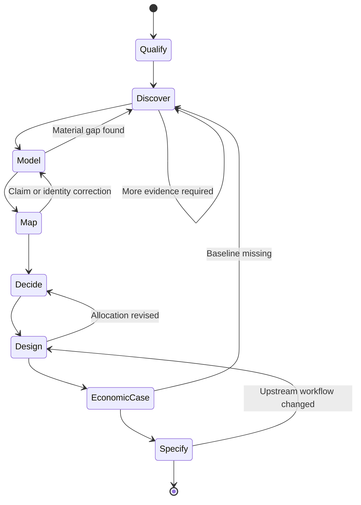

# FDE Lifecycle

## Purpose

The lifecycle is a governed state machine, not a navigation menu. Each stage has required evidence, an owner, blockers, and an explicit exit decision. AI-FDE may recommend a transition. The human FDE approves material transitions.

## V1 Lifecycle

### 1. Qualify

Confirm the business outcome, process scope, accountable sponsor, FDE owner, initial feasibility, and why the work matters now.

**Exit gate:** A named workflow, outcome, owner, and discovery plan exist.

### 2. Discover

Collect evidence and interview context. Track questions, unknowns, systems, actors, rules, exceptions, metrics, and source coverage.

**Exit gate:** The minimum evidence set is ingested and material open questions have owners.

### 3. Model

Review claims, resolve identities, preserve contradictions, and establish the verified Company Operating Model.

**Exit gate:** Material claims are reviewed. Blocking conflicts are resolved or explicitly carried forward.

### 4. Map

Construct the current-state process with its actual order, handoffs, rules, exceptions, inputs, outputs, failure modes, and evidence.

**Exit gate:** The process owner and FDE approve the current-state version.

### 5. Decide

Recommend the right execution primitive for each step. Record rationale, uncertainty, risk, controls, evaluation needs, and human accountability.

**Exit gate:** Every step has a reviewed allocation and material risks have owners.

### 6. Design

Create the target workflow. Preserve required approvals, customer systems, evidence, escalation, and recovery.

**Exit gate:** The target workflow is approved and versioned.

### 7. Economic Case

Quantify the baseline, expected change, implementation and operating cost, sensitivity, and evidence quality.

**Exit gate:** Required inputs exist, estimates are labeled, and the business case is approved.

### 8. Specify

Generate the PRD, architecture, contracts, rules, controls, evaluation plan, rollout assumptions, and implementation specification from approved versions.

**Exit gate:** Required artifacts are current, internally consistent, and implementation-ready.

## Transition Rules

- A transition is an auditable domain event.
- A stage may move backward when new evidence invalidates prior work.
- Upstream changes mark dependent artifacts stale.
- A failed gate explains the missing evidence and next valid action.
- An authorized override requires a reason, actor, timestamp, and accepted risk.
- V1 has no automatic production transition.

## Later Lifecycle

Orchestrate, Pilot, Deploy, Adopt, Measure, Learn, and Productize remain part of the product vision.
Orchestrate may later dispatch an approved WorkOrder to a sandboxed coding agent, but coding-agent
execution and autonomous remediation are not represented as V1 capabilities.
