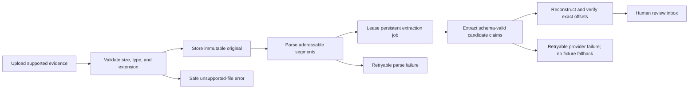
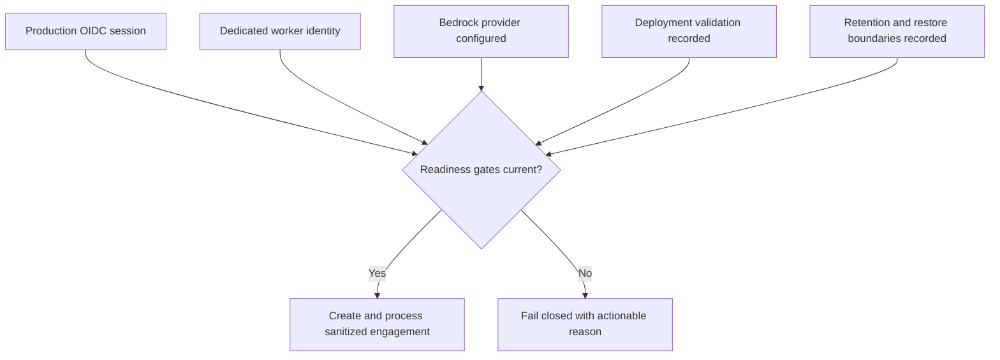
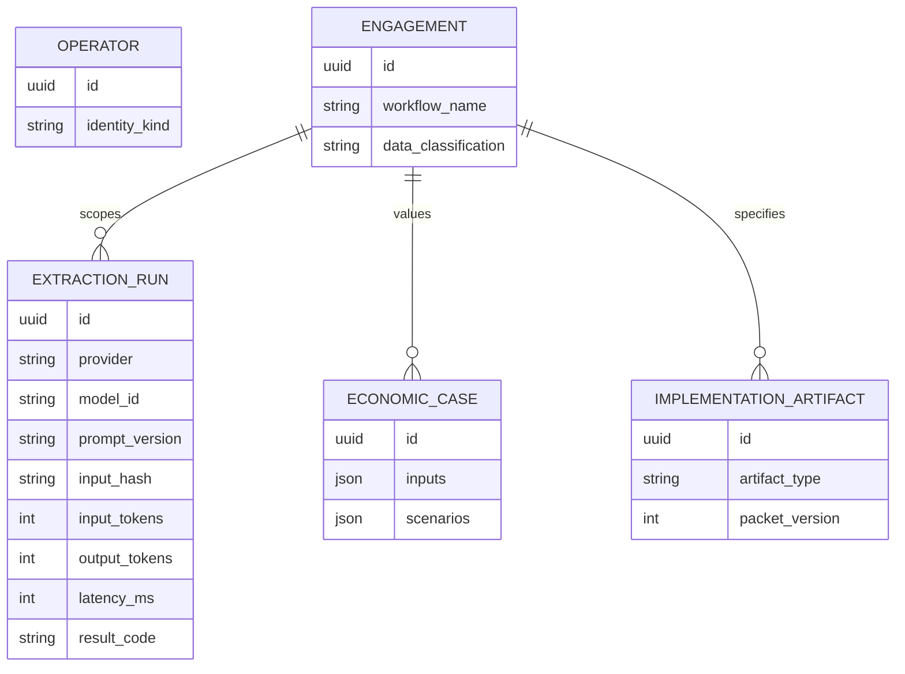

# Complete Design-Partner Readiness

## Overview

Move AI-FDE from a synthetic accounts-payable alpha to a controlled design-partner candidate. The
work closes locally implementable product gaps, adds production provider and deployment seams, and
keeps sanitized customer data fail-closed until live Auth0 and AWS validation records exist.

Coding-agent execution, production mutation, and autonomous remediation remain post-V1.

**Implementation status:** Repository work and local verification are complete. External Auth0,
AWS, restore/deletion, secret-rotation, and Bedrock evaluation gates remain open, so sanitized data
is still a no-go.

## Problem Statement

The current golden path proves the trust model but is intentionally narrow: text-only parsing,
fixture extraction, AP-specific labels, one economic scenario, one implementation artifact, a
human-shaped worker identity, and no deployable infrastructure. Those constraints prevent a
credible sanitized design-partner engagement even though the core provenance and approval model is
sound.

## Chosen Approach

Close the evidence-to-specification lifecycle before adding execution autonomy:

1. Broaden evidence parsing and introduce a provider-neutral extraction contract.
2. Add Bedrock structured extraction that fails closed outside development.
3. Give the worker an explicit service identity and engagement membership.
4. Generalize generated workflow labels and complete economic and artifact outputs.
5. Define AWS infrastructure and automated readiness checks.
6. Keep sanitized data disabled until every external gate is evidenced.

## User and Operational Flows

### Evidence flow

### Sanitized engagement gate

## Data Model Changes

## Implementation Phases

### Phase 1 — Evidence and Extraction Foundation

- [x] Add bounded parsers for TXT, Markdown, CSV, EML, PDF, and DOCX with deterministic locators.
- [x] Accept PNG/JPEG as immutable visual evidence with an addressable whole-image segment; require
      the multimodal production provider for claim extraction.
- [x] Enforce type/extension agreement, decompression/page/row limits, UTF-8 normalization, and
      content-free public errors.
- [x] Replace the concrete fixture extractor dependency with a typed `ExtractionProvider` protocol.
- [x] Add Bedrock Converse structured-output extraction with a strict candidate-claim schema,
      bounded segment requests, exact offset reconstruction, timeout/retry classification, and no
      production fallback.
- [x] Record provider/model/prompt/schema/input-hash/token/latency/result metadata without logging
      prompts, raw evidence, or raw responses.
- [x] Add parser, provider-contract, prompt-injection, malformed-output, no-claim, and retry tests.

### Phase 2 — Worker and Sanitized-Data Boundary

- [x] Accept ADR 0012 and add `operators.identity_kind` with human/service constraints.
- [x] Add separate worker configuration and fail-closed production startup validation.
- [x] Add an idempotent administration command to provision/deactivate the worker and grant an
      `operator` membership to one engagement at a time.
- [x] Lease and process only jobs visible to the worker's explicit memberships; retain RLS.
- [x] Attribute worker mutations to `actor_type=service`.
- [x] Add a versioned readiness assertion/configuration that permits sanitized data only in
      production with OIDC, a service worker, Bedrock, and a recorded deployment validation.
- [x] Test inactive/human/missing/cross-engagement/owner-only/sanitized worker cases.

### Phase 3 — General Workflow, Economics, and Specification Packet

- [x] Add an engagement `workflow_name` and remove Accounts Payable from generated titles and
      objectives while preserving the Acme fixture defaults.
- [x] Generalize assertion-to-step projection for supported ownership, system-use, rule, exception,
      decision, and handoff predicates; unsupported assertions remain visible instead of becoming
      malformed steps.
- [x] Add deterministic low/base/high scenarios with explicit input provenance and conservative
      ordering validation.
- [x] Block approval if any required scenario input is missing, invalid, or unlabeled.
- [x] Generate a version-pinned packet containing PRD, architecture brief, business rules,
      integrations/data requirements, approval controls, evaluation plan, and implementation spec.
- [x] Mark the complete packet stale atomically when a pinned dependency changes.
- [x] Expose scenarios and the artifact packet through the API and cockpit with loading, empty,
      error, success, blocked, and stale states.
- [x] Extend acceptance tests through packet generation and staleness.

### Phase 4 — Deployment and External Validation

- [x] Accept ADRs 0013 and 0014 after implementation matches their controls.
- [x] Add production Dockerfiles and Terraform for one-region ECS/Fargate web, API, and worker;
      private RDS PostgreSQL; unversioned KMS-encrypted S3; ECR; ALB/HTTPS; Secrets Manager; and
      metadata-only CloudWatch logs.
- [x] Give web, API, worker, migration, and deployment processes distinct least-privilege roles.
- [x] Keep Bedrock model invocation logging disabled and add an infrastructure assertion for it.
- [x] Add deployment validation for TLS, private networking, S3 public-access block, encryption,
      backup/PITR/Multi-AZ, restore rehearsal, deletion boundaries, task roles, and secret rotation.
- [x] Extend the Auth0 live validation record to capture PKCE, callback, cookie, allowlist, logout,
      revocation, and unauthenticated-access evidence.
- [x] Document that live validation is blocked—not passed—until real tenant/account credentials are
      supplied and evidence is recorded.

### Phase 5 — Documentation and Release Gate

- [x] Update the README capability matrix, roadmap, backlog, ADR index, onboarding, and runbooks to
      distinguish implemented, locally verified, externally validated, and deferred capability.
- [x] Keep coding-agent execution and autonomous remediation explicitly deferred.
- [x] Run migrations from a clean database, downgrade where safe, re-upgrade, RLS checks, complete
      tests, lint, type checks, accessibility, production build, and clean-environment rehearsal.
- [x] Record a design-partner go/no-go checklist; the default remains no-go for sanitized data until
      the live external gates pass.

## Flow and Edge-Case Requirements

- First-time structured-output schema compilation may take minutes; jobs remain leased, visible,
  resumable, and must not be reported as failed merely because an HTTP request is not immediate.
- Provider throttling and transient service failures retry with bounded attempts; schema,
  provenance, or policy failures fail closed without retry loops.
- Empty and image-only documents produce either zero claims or explicit needs-review state—never
  invented text.
- Duplicate uploads remain idempotent within an engagement and never deduplicate across tenants.
- A worker losing membership between lease and mutation must fail before writing customer state.
- A production OIDC session alone is insufficient to unlock sanitized data.
- Low/base/high scenarios must preserve `low <= base <= high` for benefit outputs or reject the
  draft with an actionable validation error.
- Packet generation is all-or-nothing for a dependency set; partial artifacts cannot appear current.
- Upstream changes preserve old artifacts and mark every packet member stale.
- Permanent deletion includes every new record and preserves only the existing content-free receipt.

## Acceptance Criteria

### Functional

- [x] All supported V1 evidence types produce stable locators and safely reject malformed input.
- [x] Production extraction uses Bedrock structured output through a provider-neutral contract and
      cannot fall back to fixture behavior.
- [x] Every persisted candidate quote is reconstructed from exact stored offsets.
- [x] A service worker can process only explicitly assigned engagements.
- [x] A non-AP engagement reaches an approved target workflow without AP-specific product text.
- [x] Economic output includes reproducible low/base/high scenarios.
- [x] The generated packet contains every required artifact pinned to one approved dependency set.
- [x] Sanitized engagement creation and processing fail closed until readiness evidence is current.

### Non-Functional

- [x] Normal logs contain identifiers and bounded result codes, not evidence, prompts, responses,
      tokens, cookies, callback query strings, or secrets.
- [x] Cross-engagement application and database isolation tests cover every new table and path.
- [x] Production infrastructure declares no public database or evidence bucket and uses separate task
      roles.
- [x] All long work exposes queued/running/needs-review/failed/completed/stale states and safe retry.

## Deployment Gates Requiring External Credentials

- [ ] Run and sign the Auth0 live-tenant validation record.
- [ ] Run Bedrock evaluation against the selected model/inference profile and pin the winner.
- [ ] Apply Terraform to staging through short-lived federated credentials.
- [ ] Complete restore, deletion-boundary, and sanitized golden-path rehearsals.

These checkboxes cannot be completed from repository code alone and must never be marked complete
without captured external evidence.

## Post-Deploy Monitoring & Validation

- Search metadata-only logs for extraction `result_code`, job retry exhaustion, schema/provenance
  rejection, RLS denial, authentication failure category, and deletion failure code.
- Monitor job age, attempts, completion rate, Bedrock latency/token/cost metadata, API p95, RDS
  connections/storage, ECS task restarts, and S3/Bedrock access denials.
- Healthy: no cross-engagement success, no raw-content telemetry, jobs drain within the agreed SLO,
  scenario calculations reproduce, and all packet members share one dependency fingerprint.
- Stop sanitized processing on any RLS bypass, raw-content log event, unexplained provider fallback,
  failed restore, incomplete deletion, or stale readiness record.
- Validation window: first 72 hours and the complete first design-partner engagement; owner: product
  owner plus operating FDE.

## Risks and Mitigations

- **Scope expansion:** autonomy remains out; one design-partner workflow is sufficient to validate
  generalized code.
- **False model confidence:** all outputs remain candidate claims and provenance is reconstructed.
- **Format attack surface:** strict limits, no macro execution, no embedded-object traversal, and
  parser failure isolation.
- **Provider drift:** pin model/inference profile, prompt, and schema; require evaluation before
  change.
- **Deletion mismatch:** keep S3 versioning off until version-aware deletion exists and state RDS
  backup expiry honestly.
- **Credential simulation:** external gates stay incomplete until run against real services.

## Internal References

- `README.md`
- `docs/brainstorms/2026-08-12-design-partner-readiness-brainstorm.md`
- `docs/adr/0012-production-worker-service-identity.md`
- `docs/adr/0013-aws-design-partner-deployment.md`
- `docs/adr/0014-bedrock-production-extraction.md`
- `src/ai_fde/modules/knowledge/jobs.py`
- `src/ai_fde/modules/economics/service.py`
- `src/ai_fde/modules/artifacts/service.py`
- `tests/acceptance/test_workflow_economics_specification.py`

## External Research

- [Bedrock structured outputs](https://docs.aws.amazon.com/bedrock/latest/userguide/structured-output.html)
- [Bedrock Converse API](https://docs.aws.amazon.com/bedrock/latest/userguide/conversation-inference.html)
- [Bedrock invocation logging](https://docs.aws.amazon.com/bedrock/latest/userguide/model-invocation-logging.html)
- [ECS task IAM roles](https://docs.aws.amazon.com/AmazonECS/latest/developerguide/task-iam-roles.html)
- [RDS for PostgreSQL](https://docs.aws.amazon.com/AmazonRDS/latest/UserGuide/CHAP_PostgreSQL.html)
- [S3 Block Public Access](https://docs.aws.amazon.com/AmazonS3/latest/userguide/access-control-block-public-access.html)
- [Auth0 authorization flows](https://dev.auth0.com/docs/get-started/authentication-and-authorization-flow)
