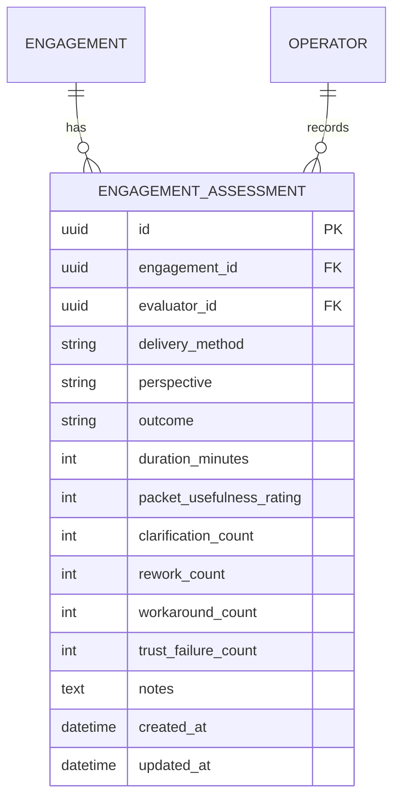

# Build the Internal Alpha Delivery System

## Overview

Implement every repository-controlled step between the successful Acme demo and a bounded
design-partner pilot. The result must support three synthetic workflow shapes, capture internal FDE
and engineering evaluation data, derive delivery/token scorecards, rehearse every profile through
the browser, and turn external staging claims into machine-checked evidence.

The implementation cannot complete actions that require people or external authority. Live Auth0,
AWS, Bedrock, restore, deletion-boundary, secret-rotation, and customer-pilot records remain open
until executed in the named environment by accountable owners.

## Problem Statement

The current repository proves one synthetic Accounts Payable workflow. That is sufficient for a
vertical slice but insufficient for internal alpha or production evidence:

- workflow breadth is unproven;
- the deterministic extractor contains Accounts Payable-specific rules;
- FDE usability and engineering handoff feedback have no durable record;
- engagement lead time and token yield are present in raw state but not summarized;
- the product cannot distinguish a baseline-ready comparison from an unsupported improvement claim;
- the clean browser rehearsal covers one workflow only;
- the AWS readiness record is not tied tightly enough to release commit, runtime image digests, and
  a live Bedrock evaluation job.

## Stakeholders

| Stakeholder            | Required outcome                                                   |
| ---------------------- | ------------------------------------------------------------------ |
| FDE operator           | Repeatable workflows and a short, honest assessment form           |
| FDE leader             | Cross-engagement delivery, quality, and baseline readiness signals |
| Engineering recipient  | Packet usefulness, clarification, and rework evidence              |
| AI platform owner      | Tokens per accepted material claim and model evaluation identity   |
| Technical owner        | Clean multi-profile rehearsal and diagnosable failures             |
| Security/release owner | Release-bound, fail-closed external readiness evidence             |
| Design partner         | One bounded workflow with explicit authority and stop conditions   |

## Proposed Solution

### 1. Synthetic workflow catalog

Seed three visibly synthetic engagements:

| Profile              | Company and workflow                          | Risk shape                                                   | Required predicates                       |
| -------------------- | --------------------------------------------- | ------------------------------------------------------------ | ----------------------------------------- |
| Exception-heavy      | Acme Manufacturing / Accounts Payable         | conflicting approval rule and exception                      | owns, uses, approval, exception           |
| Multi-system handoff | Northstar Health / Employee Access Onboarding | ordered work, two systems, role handoff, privileged approval | owns, uses, precedes, hands off, approval |
| Straight-through     | Beacon Logistics / Customer Support Triage    | named owner, system of record, sequence, policy              | owns, uses, precedes, governed by         |

Every fixture remains fictional, committed, deterministic, and labeled synthetic.

### 2. Generalized fixture extraction

Rename the local extractor to describe its actual boundary and add transparent patterns for
sequence, handoff, governance, and named approval rules. Preserve exact offsets and quotes. Do not
add model-like inference or make the deterministic provider available in production.

### 3. Durable alpha assessments

Add one engagement-scoped assessment table. One authenticated evaluator owns one current record for
each combination of delivery method and perspective.

Allowed values:

- delivery method: `ai_fde`, `conventional`;
- perspective: `operator`, `engineering`;
- outcome: `completed`, `blocked`, `abandoned`;
- duration: 1–10,080 minutes;
- usefulness: 1–5;
- event counts: 0–10,000.

An AI-FDE `completed` assessment is rejected until the engagement has one current seven-artifact
packet. Audit details contain only structured values, never assessment notes.

### 4. Objective scorecards

The engagement scorecard derives:

- evidence readiness and packet milestone timestamps;
- total, accepted, rejected, deferred, pending, and accepted-material claims;
- total/resolved/blocking contradictions;
- current packet count/version and time to packet;
- provider runs, model IDs, input/output/total tokens, latency, and tokens per accepted material
  claim;
- the current evaluator assessments.

The internal-alpha program scorecard aggregates only visible synthetic engagements. It reports
profile coverage, completed packets, assessment counts, token totals, and absolute quality measures.
Comparison readiness requires three completed operator assessments per method across three distinct
engagements. Percentage improvement remains deliberately absent.

### 5. Multi-profile browser rehearsal

Drive all three profiles through the production-mode web application:

```mermaid
flowchart LR
    S["Fresh infrastructure"] --> D["Seed three profiles"]
    D --> W["Worker extracts claims"]
    W --> R["Human-style review in browser"]
    R --> C["Resolve profile conflicts"]
    C --> F["Approve current and target workflows"]
    F --> E["Approve sensitivity economics"]
    E --> P["Generate seven-artifact packets"]
    P --> A["Record AI-FDE assessments"]
    A --> G["Verify alpha scorecard"]
    G --> X["Capture evidence and clean up"]
```

The rehearsal uses the existing dedicated Compose project and production Next.js server. The test
fails on browser console errors, failed AI-FDE API calls, missing predicates, incomplete packets, or
an unready alpha scorecard.

### 6. Release-bound staging validation

Extend the readiness verifier to require and validate:

- a 40-character Git commit;
- immutable web, API, and worker image URIs by digest;
- live ECS service task definitions matching those images;
- enabled ECS deployment circuit breaker and rollback;
- explicit ECS container version consistency;
- a completed Bedrock model-evaluation job;
- the evaluated model or inference profile matching the configured production identifier;
- the existing Auth0, restore, deletion, and secret-rotation evidence IDs.

The emitted record remains metadata-only and must never contain customer content or credentials.

## User Flow Analysis

### Assessment flow

1. An authenticated member opens a synthetic engagement.
2. The scorecard loads independently of the workflow controls.
3. The evaluator selects conventional or AI-FDE delivery, operator or engineering perspective, and
   an outcome.
4. The evaluator records duration, usefulness, structured error/rework counts, and optional
   non-sensitive notes.
5. The API validates membership and product gates.
6. The service inserts or updates that evaluator's current assessment and records an audit event.
7. The scorecard refreshes and the engagement export becomes stale.

### Program scorecard flow

1. The engagement list loads the authenticated operator's visible synthetic workspaces.
2. Objective packet/token measures and structured assessments are aggregated.
3. The UI shows baseline status explicitly.
4. Comparison-ready remains false until the sample threshold and distinct-workflow threshold pass.

### Error and recovery flow

- Loading failure shows an inline retryable error without hiding the core workflow.
- Invalid counts or duration return a bounded validation message.
- AI-FDE completion before a current packet returns a stage-gate message.
- A repeated submission updates the evaluator's current assessment under a row lock.
- A cross-engagement assessment read or write is denied by application authorization and RLS.
- Export, deletion, and restore include the assessment table.
- A failed browser or runtime rehearsal preserves bounded logs and always removes dedicated data.

## Flow Permutations

| Dimension               | Required behavior                                                        |
| ----------------------- | ------------------------------------------------------------------------ |
| First-time evaluator    | Empty assessment form and objective metrics remain visible               |
| Returning evaluator     | Current method/perspective record can be updated                         |
| Operator vs engineering | Stored and summarized separately                                         |
| Conventional vs AI-FDE  | Comparable schema; no implied causation                                  |
| Completed before packet | Conventional allowed; AI-FDE rejected                                    |
| Blocked/abandoned       | Allowed before packet and retained as delivery evidence                  |
| Viewer membership       | Scorecard readable; assessment mutation denied                           |
| Sanitized engagement    | Hidden/denied unless the production data gate is active                  |
| Mobile/zoom/keyboard    | Form labels, controls, messages, and cards remain reachable              |
| Concurrent submission   | One current record per evaluator/method/perspective                      |
| Deletion                | Assessment content deleted with engagement; receipt remains content-free |

## Implementation Phases

### Phase 1 — Fixture breadth

- [x] Add Northstar Health multi-system handoff evidence.
- [x] Add Beacon Logistics straight-through evidence.
- [x] Refactor seeding into an idempotent three-profile catalog.
- [x] Generalize deterministic fixture extraction for sequence, handoff, governance, and named
      approval rules.
- [x] Preserve exact provenance and production-provider boundaries.
- [x] Add unit coverage for every supported deterministic predicate.

### Phase 2 — Assessment and scorecard domain

- [x] Add the engagement assessment model and migration.
- [x] Add check constraints, uniqueness, indexes, foreign keys, RLS, and runtime grants.
- [x] Add assessment create/update/list services with audit events and packet completion gate.
- [x] Add engagement and internal-alpha scorecard services.
- [x] Include assessments in export fingerprints, portability archives, deletion counts, and cascade
      deletion.
- [x] Add typed API request/response schemas and authorized routes.
- [x] Add unit, acceptance, API authorization, RLS, export, and deletion tests.

### Phase 3 — Operator and leader experience

- [x] Add web types and API clients for assessments and scorecards.
- [x] Add an internal-alpha program scorecard to the engagement list.
- [x] Add a delivery-evaluation workspace to each engagement.
- [x] Provide loading, empty, validation, success, and failure states.
- [x] Explain the three-sample baseline threshold and prohibit unsupported percentage claims.
- [x] Add accessible labels, keyboard behavior, live messages, and responsive layout.

### Phase 4 — Multi-profile rehearsal

- [x] Add a Playwright internal-alpha specification covering all three workflows.
- [x] Review claims, resolve contradictions, approve workflows/economics, and generate packets through
      public UI/API behavior.
- [x] Record one AI-FDE operator assessment per profile.
- [x] Verify three completed packets and baseline-not-ready status without a conventional comparator.
- [x] Parameterize the isolated demo runner with an allowlisted browser test and evidence name.
- [x] Add `make alpha-rehearsal` and preserve `make demo-rehearsal` behavior.
- [x] Capture a tracked internal-alpha scorecard screenshot for the README.

### Phase 5 — External staging and pilot gates

- [x] Bind the readiness record to Git commit and immutable runtime images.
- [x] Validate ECS task images, rollback circuit breakers, and version consistency.
- [x] Validate a completed Bedrock evaluation job and exact model/inference-profile identity.
- [x] Add unit tests for readiness failure and success paths.
- [x] Update the Terraform task definitions with explicit version consistency.
- [x] Write internal-alpha, production-staging, and bounded-pilot runbooks.
- [x] Update the design-partner go/no-go record, delivery plan, documentation index, and README.

### Phase 6 — Verification and shipping

- [x] Run focused unit and integration tests after each domain change.
- [x] Run the complete multi-profile browser rehearsal and inspect the final screenshot.
- [x] Run accessibility, keyboard, and reduced-motion tests.
- [x] Run the clean migration downgrade/re-upgrade rehearsal and complete test/static/build suite.
- [x] Run Terraform format/validation, shell checks, Markdown formatting/link checks, and
      `git diff --check`.
- [x] Confirm no credentials, real customer data, Terraform state, runtime databases, or untracked
      exports are committed.
- [ ] Record actual test evidence, close this plan, merge to main, and push.

## Acceptance Criteria

### Functional

- [x] A clean seed produces exactly the three documented synthetic workflow profiles.
- [x] Every profile produces material claims with exact evidence and at least three distinct workflow
      predicates.
- [x] Every profile reaches an approved seven-artifact packet through the browser.
- [x] An evaluator can record and update conventional or AI-FDE assessments.
- [x] AI-FDE completion cannot be recorded before a current packet exists.
- [x] Engagement and program scorecards derive objective measures from canonical state.
- [x] Comparison readiness stays false without three matched workflow samples per method.
- [x] Assessment changes stale an existing export and are removed by permanent deletion.
- [x] The readiness verifier rejects mismatched images, disabled rollback, incomplete Bedrock
      evaluation, or a different model identifier.

### Non-functional

- [x] All assessment records are engagement-scoped and protected by RLS.
- [x] Audit and access logs never contain assessment notes or raw evidence.
- [x] Browser forms expose complete loading, empty, error, pending, and success feedback.
- [x] The alpha rehearsal is isolated, repeatable, and cleans up on interruption or failure.
- [x] Deterministic extraction remains development/test-only and visibly synthetic.
- [x] Sanitized data remains disabled without a current external readiness record.

## Testing Strategy

| Layer                       | New coverage                                                            |
| --------------------------- | ----------------------------------------------------------------------- |
| Extractor unit              | every predicate, exact offset, no unsupported inference                 |
| Assessment unit/integration | validation, upsert, audit redaction, packet gate                        |
| Scorecard unit/integration  | milestones, claim yield, tokens, comparison threshold                   |
| Isolation                   | cross-operator table and endpoint access                                |
| Data lifecycle              | export fingerprint, archive membership, deletion count/cascade          |
| Browser                     | all three profiles plus assessment and aggregate scorecard              |
| Accessibility               | new scorecard and form in existing axe/keyboard suite                   |
| Readiness unit              | images, circuit breaker, version consistency, Bedrock evaluation        |
| Clean rehearsal             | migration upgrade/downgrade, full suite, static checks, optimized build |

## Verification Evidence

Recorded against the completed working tree on 2026-08-14:

- `uv run pytest`: 47 passed; one upstream Starlette/httpx deprecation warning.
- `uv run ruff check .` and `uv run mypy src tests scripts`: passed.
- `pnpm --dir apps/web lint`, `typecheck`, and `build`: passed; four Next.js routes built.
- `make accessibility`: five Playwright axe, keyboard, landmark, and reduced-motion checks passed.
- `make demo-rehearsal`: passed from empty infrastructure in 16 seconds.
- `make alpha-rehearsal`: passed all three workflows from empty infrastructure in 27 seconds;
  generated and visually inspected `output/playwright/internal-alpha/internal-alpha-scorecard.png`.
- `make rehearse`: passed clean migration upgrade/downgrade/re-upgrade, drift check, 47 tests,
  static analysis, and optimized build with disposable infrastructure cleanup.
- Terraform format check and validation: passed.
- Shell syntax, Markdown Prettier check, local Markdown link check, `git diff --check`, and bounded
  secret-pattern scan: passed.

Live Auth0, AWS, restore, deletion-boundary, secret-rotation, Bedrock evaluation, and customer-pilot
records were not fabricated. The repository remains NO-GO for sanitized customer data until those
external gates are executed and signed.

## Delivery and Rollback

1. Merge only after local clean and browser rehearsals pass.
2. Use the synthetic profiles for internal demo and alpha onboarding.
3. Collect three conventional and three AI-FDE operator assessments before interpreting comparison
   data.
4. Correct P0/P1 product failures before external deployment.
5. Run the hardened readiness verifier in production-equivalent staging.
6. Keep sanitized data disabled until the signed go/no-go record passes.
7. Admit one workflow and one named FDE into the bounded pilot.

Code rollback reverts the release commit. Database rollback is supported only while no assessment
rows need preservation; otherwise retain the additive table and forward-fix application code.
Deployed rollback uses previous immutable image digests and must not reverse an incompatible schema
change.

## Post-Deploy Monitoring & Validation

- Search metadata-only logs for `engagement.assessment_recorded`, `result_code`, failed provider
  runs, exhausted jobs, HTTP 5xx, authorization denials, and deletion failure codes.
- Monitor API p95, worker queue age, extraction attempts, token totals, accepted-material-claim yield,
  time to packet, ECS deployment state, RDS health, and S3/Bedrock denials.
- Healthy means three synthetic profiles complete, assessment updates remain isolated, packet and
  export fingerprints stay current, and no sensitive fields reach telemetry.
- Stop or roll back on any isolation bypass, unauthorized assessment mutation, raw-content logging,
  packet/version mismatch, provider fallback, failed restore/deletion, or readiness-record mismatch.
- Validation window: every internal-alpha session, the first 72 hours of staging, and the first
  complete design-partner engagement. Owners: technical owner and operating FDE; security/release
  owner retains stop authority.

## Risks and Mitigations

| Risk                                                    | Mitigation                                                             |
| ------------------------------------------------------- | ---------------------------------------------------------------------- |
| Synthetic breadth is mistaken for production AI quality | Label fixtures and keep Bedrock live evaluation separate               |
| Self-reported metrics become marketing claims           | Show sample readiness and omit percentage improvement                  |
| Assessment notes expose evidence                        | Optional warning, bounded length, no note content in audit/logs        |
| New table escapes lifecycle controls                    | RLS, export, fingerprint, deletion, and restore coverage               |
| Browser rehearsal becomes slow or brittle               | Accessible selectors, three bounded profiles, lower-layer permutations |
| Readiness IDs are supplied without matching release     | Verify commit, images, ECS controls, job, and model identity           |
| External credentials are unavailable                    | Complete code and runbooks; keep live gates visibly open               |

## Expected File Changes

- `fixtures/northstar/evidence/*.md`
- `fixtures/beacon/evidence/*.md`
- `src/ai_fde/seed.py`
- `src/ai_fde/modules/knowledge/extractor.py`
- `src/ai_fde/modules/engagements/evaluation.py`
- `src/ai_fde/models.py`
- `migrations/versions/*_internal_alpha_assessments.py`
- `src/ai_fde/modules/data_lifecycle/service.py`
- `src/ai_fde/api/schemas.py`
- `src/ai_fde/api/routes.py`
- `apps/web/lib/types.ts`
- `apps/web/lib/api.ts`
- `apps/web/components/delivery-evaluation-workspace.tsx`
- `apps/web/components/engagement-cockpit.tsx`
- `apps/web/app/page.tsx`
- `apps/web/tests/e2e/internal-alpha.spec.ts`
- `scripts/rehearse-sample-demo.sh`
- `scripts/verify_design_partner_readiness.py`
- `infrastructure/terraform/design-partner/ecs.tf`
- `tests/unit/`, `tests/acceptance/`, and `tests/isolation/`
- `docs/runbooks/`, `docs/delivery/`, `docs/README.md`, and `README.md`

## Internal References

- `docs/brainstorms/2026-08-14-internal-alpha-delivery-system.md`
- `docs/delivery/design-partner-delivery-plan.md`
- `docs/testing/end-to-end-test-strategy.md`
- `docs/runbooks/design-partner-go-no-go.md`
- `docs/runbooks/sample-demo.md`
- `src/ai_fde/modules/data_lifecycle/service.py`
- `src/ai_fde/modules/workflows/service.py`
- `tests/isolation/test_row_level_isolation.py`
- `apps/web/tests/e2e/golden-path.spec.ts`

## External Primary Sources

- [Amazon Bedrock model evaluation jobs](https://docs.aws.amazon.com/bedrock/latest/userguide/model-evaluation-jobs-management-create.html)
- [Amazon Bedrock CreateEvaluationJob API](https://docs.aws.amazon.com/bedrock/latest/APIReference/API_CreateEvaluationJob.html)
- [Amazon ECS deployment circuit breaker](https://docs.aws.amazon.com/AmazonECS/latest/APIReference/API_DeploymentCircuitBreaker.html)
- [Amazon ECS rolling deployment and image digest behavior](https://docs.aws.amazon.com/AmazonECS/latest/developerguide/deployment-type-ecs.html)
- [Auth0 OIDC logout](https://auth0.com/docs/api/authentication/logout/oidc-logout)
- [Auth0 refresh-token revocation](https://auth0.com/docs/api/authentication/revoke-refresh-token/revoke-refresh-token)
