# Add Repeatable End-to-End Delivery Rehearsal

## Overview

Prove the complete synthetic AI-FDE operator journey through the real web application in a clean,
isolated environment. Package the proof as a repeatable command and document how internal AI teams
should test, demonstrate, release, monitor, and stop the product.

This plan covers repository-local V1 proof. It does not turn local success into approval for
sanitized customer data or claim that Auth0, AWS, Bedrock, restore, deletion boundaries, or secret
rotation have been validated live.

## Problem Statement

AI-FDE already has strong domain acceptance tests and a clean dependency/build rehearsal. The
remaining gap is the boundary between them:

- the clean rehearsal does not drive the browser;
- the browser checks focus on accessibility rather than the complete lifecycle;
- the visual demo depends on a human following a checklist;
- there is no single command that proves UI, API, worker, database, object storage, and generated
  packet integration together;
- implementation, testing, and delivery gates are spread across several documents.

A polished screen is not enough. The repository needs reproducible evidence that the product can
move from seeded evidence to an approved implementation packet without hidden database edits.

## Users and Stakeholders

| Stakeholder               | Need from this work                                                   |
| ------------------------- | --------------------------------------------------------------------- |
| Human FDE                 | A stable talk track and trustworthy sample engagement                 |
| FDE leader                | A repeatable proof of delivery speed, controls, and handoff quality   |
| Internal AI platform team | Clear test layers, ownership, failure evidence, and cost boundaries   |
| Engineering team          | One command that reproduces integration failures locally              |
| Security or release owner | Explicit separation between local proof and external release approval |

## Chosen Approach

Extend the existing Playwright setup with a synthetic golden-path test. Run it from an isolated
shell rehearsal that owns its Docker project, ports, application processes, logs, and cleanup. Keep
the current Python acceptance suite as the authoritative domain-invariant layer. Add three durable
documents: test strategy, delivery plan, and sample-demo runbook.

No external research is required. The repository already defines the lifecycle, trust model,
deployment boundary, acceptance tests, and cleanup conventions needed for this work.

## End-to-End Flow

```mermaid
flowchart LR
    A["Create isolated infrastructure"] --> B["Migrate and seed synthetic Acme"]
    B --> C["Start API, worker, and web"]
    C --> D["Open cockpit in Playwright"]
    D --> E["Review six claims"]
    E --> F["Resolve approval contradiction"]
    F --> G["Approve current workflow"]
    G --> H["Approve target allocation"]
    H --> I["Calculate and approve scenarios"]
    I --> J["Generate seven-artifact packet"]
    J --> K["Verify UI, API, console, and artifacts"]
    K --> L["Stop processes and delete temporary resources"]
```

## Test Architecture

| Layer                 | Purpose                                            | Primary command           | Failure evidence                           |
| --------------------- | -------------------------------------------------- | ------------------------- | ------------------------------------------ |
| Unit                  | Parsers, providers, calculations, configuration    | `make test`               | Pytest assertion and bounded logs          |
| Domain acceptance     | Provenance, approvals, staleness, export, deletion | `make acceptance`         | State-level assertion failure              |
| Isolation             | Application authorization and PostgreSQL RLS       | `make acceptance`         | Denied-access assertion failure            |
| Browser accessibility | WCAG, keyboard, reduced motion                     | `make accessibility`      | Playwright trace, screenshot, axe report   |
| Browser golden path   | Complete operator journey through every runtime    | `make demo-rehearsal`     | Playwright trace, screenshot, service logs |
| Build and static      | Types, lint, optimized application                 | `make lint`, `pnpm build` | Compiler, linter, or build output          |
| Infrastructure static | Terraform policy and schema                        | `make terraform-check`    | Terraform validation output                |
| External staging      | Auth0, AWS, Bedrock, recovery, deletion            | Go/no-go record           | Signed live evidence; remains open locally |

## Flow Analysis and Permutations

| Dimension        | Sample demo path                                                              | Separate verification                                                                      |
| ---------------- | ----------------------------------------------------------------------------- | ------------------------------------------------------------------------------------------ |
| Identity         | Explicit local development operator                                           | Auth0 login, logout, revocation, allowlist, and expiry in live tenant                      |
| Data class       | Synthetic Acme only                                                           | Sanitized data stays disabled until the deployed go/no-go record passes                    |
| Operator state   | First run from an empty database                                              | Resume and historical state are covered by persistent-state tests                          |
| Browser          | Desktop Chromium happy path                                                   | Keyboard, reduced motion, and WCAG checks remain in accessibility tests                    |
| Extraction       | Deterministic fixture provider                                                | Bedrock schema, provenance, retry, cost, and model selection in provider tests and staging |
| Data lifecycle   | Inspect retention/export/deletion gates but preserve the final packet         | Export and destructive deletion run in isolated backend acceptance tests                   |
| Failure recovery | Bounded health polling, Playwright trace, service logs, unconditional cleanup | Restore, image rollback, backup expiry, and secret rotation in external staging            |

The demo does not delete the engagement because its purpose is to leave the approved engineering
handoff visible for inspection. Destructive lifecycle behavior remains required, but it is proven
by a separate acceptance test that can verify the surviving content-free receipt.

## Implementation Phases

### Phase 1 — Rehearsal Contract

- [x] Add a Playwright golden-path specification for the seeded Acme engagement.
- [x] Assert the synthetic label before making any decision.
- [x] Review all six candidate claims through the cockpit.
- [x] Accept the four workflow-relevant claims and reject the two entity-only duplicates.
- [x] Resolve the CFO/Controller contradiction as an accepted exception with an operator reason.
- [x] Generate and approve current and target workflows.
- [x] Verify conservative Human/Software allocations remain visible.
- [x] Calculate and approve deterministic low/base/high economics.
- [x] Generate and inspect all seven current artifact tabs.
- [x] Verify the implementation specification contains the business outcome, exact rule, economics,
      version pins, and V1 boundary.
- [x] Fail on unexpected browser console errors or failed API responses.

### Phase 2 — Isolated Demo Command

- [x] Add environment overrides to Playwright configuration without changing default developer use.
- [x] Add a script that uses a dedicated Docker Compose project, ports, bucket, and temporary logs.
- [x] Apply every migration from an empty database and run the synthetic seed.
- [x] Start API, worker, and web processes with explicit demo configuration.
- [x] Wait on health endpoints and worker-completed evidence instead of fixed sleeps.
- [x] Run only the golden-path browser specification for the sample demo.
- [x] Always stop child processes and remove containers, networks, and volumes on success or failure.
- [x] Add `make demo-rehearsal` as the stable operator command.

### Phase 3 — Test and Delivery Documentation

- [x] Write a detailed test strategy covering scope, layers, data, environments, ownership, gates,
      defect severity, evidence retention, and release decisions.
- [x] Write a delivery plan covering internal demo, internal alpha, staging validation,
      design-partner entry, rollback triggers, and post-deploy monitoring.
- [x] Write a sample-demo runbook with setup, talk track, expected observations, failure recovery,
      and cleanup.
- [x] Link every new document from the documentation index and README quality commands.
- [x] Record the executed rehearsal date, commit, result, duration, and exceptions.

### Phase 4 — Execution and Quality

- [x] Run the new clean browser rehearsal from start to finish.
- [x] Inspect the final screenshot and browser trace when produced.
- [x] Review browser console and network failures.
- [x] Run the complete Python suite.
- [x] Run Ruff, mypy, ESLint, and TypeScript checks.
- [x] Run the optimized Next.js build.
- [x] Run Markdown formatting, local-link checks, and `git diff --check`.
- [x] Confirm the working tree contains no runtime evidence, credentials, databases, or real exports.

## Browser Acceptance Cases

### Happy Path

1. The engagement list shows exactly one synthetic Acme engagement.
2. Evidence processing completes and six candidate claims appear.
3. Exact evidence and source offsets are visible for each claim.
4. Human decisions reduce the review queue to zero and create four verified assertions.
5. The contradiction cannot disappear without a classification and reason.
6. The current workflow has four steps and becomes approved.
7. The target workflow preserves approval authority and NetSuite.
8. The economic case shows ordered low/base/high benefits and an approved base case.
9. The packet contains exactly seven current artifacts under one packet version.
10. The final implementation specification remains bounded to V1.

### Negative and Recovery Paths

- Current-workflow approval remains blocked while the contradiction is open unless an audited
  override reason is supplied.
- Economics remains locked until target approval.
- Packet generation remains locked until economic approval.
- A failed API request produces an alert and causes the browser test to fail.
- An unexpected browser exception or error-level console event fails the rehearsal.
- A worker or web process exit fails the health check and preserves bounded logs for diagnosis.
- Cleanup runs after interruption, assertion failure, or normal completion.
- Rerunning the rehearsal starts from new volumes and cannot inherit the previous result.
- A port already in use fails before infrastructure starts and reports the conflicting port.
- A delayed worker is handled by bounded polling; a timed-out review queue reports evidence and job
  status rather than hanging indefinitely.
- Browser warnings are retained for review. Error-level console events and failed AI-FDE API
  responses fail the run; unrelated browser extension traffic is not part of the test context.

## Non-Functional Requirements

- No real or sanitized customer data.
- No production credentials or network calls to Auth0, AWS, or Bedrock.
- No fixed database edits or direct approval mutations from the test.
- The script must not use the default development database or object bucket.
- The rehearsal must be repeatable on macOS with Docker Desktop and repository prerequisites.
- Service logs must avoid raw evidence, prompts, cookies, tokens, and secrets.
- Browser assertions must use accessible roles and labels rather than CSS implementation details.
- Cleanup must be idempotent and safe when some processes never started.
- The rehearsal runs serially because it mutates one synthetic engagement through irreversible
  approval states.
- Default demo ports can be overridden so a second isolated developer can run the rehearsal.

## Delivery Plan

| Stage               | Entry criteria                                           | Required evidence                                            | Exit decision                 |
| ------------------- | -------------------------------------------------------- | ------------------------------------------------------------ | ----------------------------- |
| Developer rehearsal | Dependencies and Docker available                        | Clean browser pass plus unit/static gates                    | Merge eligible                |
| Internal demo       | Merged commit and synthetic-only configuration           | Demo runbook completed with no hidden intervention           | Internal alpha eligible       |
| Internal alpha      | Named FDE owner and baseline metrics                     | Repeated engagements, defects, timing, and handoff feedback  | Staging candidate             |
| External staging    | Auth0/AWS/Bedrock credentials and approved data boundary | Signed live go/no-go record, restore, deletion, and rollback | Design-partner decision       |
| Design partner      | Every P0 external gate current                           | Sanitized golden path and 72-hour monitoring                 | Continue, pause, or roll back |

## Release and Rollback Rules

### Healthy Signals

- Every seeded source becomes processed evidence.
- Six claims are reviewable and four material assertions are verified.
- The review queue and blocking contradiction reach zero through audited actions.
- Current workflow, target workflow, economics, and packet are approved/current.
- No unexpected browser console errors, failed API calls, RLS denials, or worker retry exhaustion.

### Stop or Roll Back

- Any cross-engagement access succeeds.
- Raw evidence, tokens, cookies, prompts, or secrets appear in normal logs.
- A stage unlocks without its required human approval.
- Scenario ordering or formula reproduction fails.
- The packet mixes dependency versions or appears current after an upstream change.
- Cleanup leaves demo containers, volumes, or application processes running.

Repository-local rollback is a revert to the prior known-good commit. A deployed rollback must use
the previous pinned image digests and must not reverse an incompatible database migration. Live
rollback remains an external staging rehearsal gate.

## Post-Deploy Monitoring & Validation

- Search metadata-only logs for `result_code`, exhausted job attempts, provenance rejection,
  authorization denial, HTTP 5xx, and deletion failure codes.
- Watch job age and completion, API p95, worker restarts, model token/cost metadata, RDS health, and
  S3 or Bedrock access denials.
- Healthy means jobs drain, stage gates hold, formulas reproduce, packet fingerprints match, and no
  sensitive content reaches telemetry.
- Stop sanitized processing on any isolation failure, provider fallback, raw-content telemetry,
  restore failure, incomplete deletion, or stale readiness record.
- Validation window is the first 72 hours and first complete engagement. Owners are the technical
  owner and operating FDE.

## Acceptance Criteria

### Functional

- [x] One command creates a clean synthetic environment and completes the cockpit golden path.
- [x] The browser test performs every material decision through public UI/API behavior.
- [x] Exactly seven version-pinned artifacts are visible at completion.
- [x] The command exits nonzero on a browser, API, worker, or assertion failure.
- [x] Temporary services and data are removed after every run.

### Quality

- [x] All existing tests and static checks pass.
- [x] The optimized production web build passes.
- [x] The test strategy and delivery plan name owners and measurable gates.
- [x] The demo runbook can be followed without database editing.
- [x] The sample run is recorded with its actual result and limitations.

## Completion Record

| Evidence                                 | Result                                                              |
| ---------------------------------------- | ------------------------------------------------------------------- |
| Tested implementation                    | `f9a2c82` (`test: add end-to-end delivery rehearsal`)               |
| Production-mode browser rehearsal        | Passed; 1 browser test in 2.3 seconds, 16 seconds end to end        |
| Clean migration and repository rehearsal | Passed; upgrade, downgrade, re-upgrade, and no drift                |
| Python suite                             | 42 passed                                                           |
| Static and build gates                   | Ruff, mypy, ESLint, TypeScript, and optimized Next.js build passed  |
| Accessibility                            | 5 Playwright WCAG, keyboard, focus, and reduced-motion tests passed |
| Infrastructure static validation         | Terraform format and validation passed                              |
| Documentation quality                    | Prettier, 52-file local-link scan, and `git diff --check` passed    |
| Runtime cleanup                          | Dedicated containers, volumes, API, and web listeners removed       |
| External release state                   | NO-GO remains for sanitized data until every live gate passes       |

## Risks and Mitigations

| Risk                                         | Mitigation                                                                                     |
| -------------------------------------------- | ---------------------------------------------------------------------------------------------- |
| Flaky asynchronous evidence processing       | Poll visible state and health with bounded timeouts                                            |
| Demo passes against stale local data         | Dedicated project, bucket, volumes, ports, and seed every run                                  |
| Browser test becomes coupled to styling      | Use roles, labels, headings, and user-visible state                                            |
| Cleanup kills unrelated development work     | Track only explicit child PIDs and a dedicated Compose project                                 |
| Local proof is presented as production proof | Keep external gates and sanitized-data no-go visible in every document                         |
| Long rehearsal slows normal development      | Keep unit/acceptance commands separate; run browser rehearsal at integration and release gates |

## Expected File Changes

- `apps/web/tests/e2e/golden-path.spec.ts`
- `apps/web/playwright.config.ts`
- `apps/web/package.json`
- `apps/web/app/layout.tsx`
- `apps/web/app/icon.svg`
- `scripts/rehearse-sample-demo.sh`
- `Makefile`
- `.gitignore`
- `docs/testing/end-to-end-test-strategy.md`
- `docs/delivery/design-partner-delivery-plan.md`
- `docs/runbooks/sample-demo.md`
- `docs/runbooks/clean-environment-rehearsal.md`
- `docs/README.md`
- `README.md`

## Internal References

- `docs/brainstorms/2026-08-14-end-to-end-delivery-rehearsal.md`
- `docs/plans/2026-08-12-feat-design-partner-readiness-plan.md`
- `docs/runbooks/clean-environment-rehearsal.md`
- `docs/runbooks/operator-onboarding.md`
- `tests/acceptance/test_evidence_to_verified_model.py`
- `tests/acceptance/test_workflow_economics_specification.py`
- `tests/acceptance/test_engagement_data_lifecycle.py`
- `apps/web/tests/e2e/accessibility.spec.ts`
- `scripts/rehearse-clean-environment.sh`

## Research Notes

- No relevant `docs/solutions/` knowledge base exists in this repository.
- Existing local patterns are sufficient; no external research is needed.
- The authoritative production gate remains `docs/runbooks/design-partner-go-no-go.md`.
