# AI-FDE Operator Cockpit V1 PRD

**Status:** Approved for V1
**Date:** 2026-08-08
**Target:** Internal alpha at six weeks; design-partner candidate at eight weeks

**Scope amendment:** Coding-agent execution, autonomous remediation, pilot execution, continuous ROI tracking, and higher autonomy levels are post-V1. The V1 lifecycle ends at an implementation-ready specification.

## 1. Problem

A human FDE spends too much time reconstructing customer context, reconciling conflicting statements, documenting processes, and translating analysis into engineering work. Existing chat and retrieval tools can summarize documents but do not maintain a verified, temporal model of how the business operates.

The result is slow discovery, fragile requirements, missed exceptions, unsafe automation, and weak business cases.

## 2. User

The sole V1 persona is an internal Forward Deployed Engineer.

The FDE owns customer communication and material decisions. AI-FDE accelerates the work and preserves its evidence. Customer users, administrators, and executives may become later personas but do not drive V1 UX.

## 3. V1 Outcome

For one Acme Manufacturing accounts-payable workflow, the FDE can:

1. create an engagement;
2. ingest realistic enterprise evidence;
3. review extracted candidate claims;
4. verify a Company Operating Model;
5. inspect contradictions, unknowns, and exact evidence;
6. approve a current-state workflow;
7. review a Human / Software / AI allocation;
8. approve a target-state workflow;
9. inspect a quantified business case and its assumptions;
10. generate versioned PRD, architecture, evaluation, and implementation-specification artifacts.

The V1 vertical slice ends at an implementation-ready specification. It does not claim coding-agent execution, a real customer pilot, production deployment, adoption, or realized ROI.

## 4. Scope

### 4.1 Engagement Workspace

- Create and open the Acme engagement.
- Show the current lifecycle stage, blockers, and recent activity.
- Scope every record, job, event, and tool call to the engagement.
- Resume an interrupted workflow without losing state.

### 4.2 Evidence Ingestion

- Upload supported V1 files: PDF, DOCX, TXT, Markdown, CSV, PNG/JPEG diagrams, and email exports or fixtures.
- Capture an operator note as a timestamped evidence asset when discovery produces information that is not yet in a customer document.
- Record content hash, source type, source date, uploader, and ingestion time.
- Preserve the original file as immutable evidence while its retention policy permits storage.
- Parse content into addressable evidence segments.
- Show queued, processing, needs-review, failed, and complete states.
- Retry safely without duplicating claims.

Slack and email are fixture imports in V1. Live connectors are out of scope.

### 4.3 Claim Extraction and Review

- Extract candidate people, roles, systems, processes, steps, rules, exceptions, metrics, and relationships.
- Link every claim to one or more exact evidence segments.
- Show model confidence separately from human verification.
- Let the FDE accept, edit, reject, defer, or mark a claim unknown.
- Detect potential duplicates and identity matches without silently merging them.
- Detect conflicts with accepted assertions and create contradiction records.
- Require explicit review for material rules, exceptions, approvals, and economics inputs.

### 4.4 Company Operating Model

- Search and inspect verified entities and relationships.
- Show provenance, current status, history, and conflicts.
- Distinguish candidate, verified, rejected, superseded, conflicted, and unknown information.
- Provide a searchable list/detail view. A bounded graph view is P1 and must not block the vertical slice.
- Let agents query structured model data and retrieve cited evidence.
- Let the FDE correct an accepted assertion through a new reviewed version. Never mutate verified history in place.

### 4.5 Current-State Workflow

- Create a versioned process and workflow from verified assertions.
- Represent events, human tasks, software tasks, decisions, approvals, integrations, exceptions, escalations, inputs, and outputs.
- Capture owner, system, rule, duration, volume, risk, failure cost, and evidence for each step.
- Prevent approval while material blocking unknowns or contradictions remain.
- Preserve manual edits and show what was generated by AI.

### 4.6 Allocation and Target Workflow

- Recommend Human, Software, AI, or AI + Human for each step.
- Base the recommendation on determinism, judgment, failure cost, reversibility, frequency, evaluation ability, regulation, confidence, and data readiness.
- Show rationale, risks, required controls, and recommended approval level.
- Generate a target workflow as a new version. Never overwrite current state.
- Let the FDE accept or change each recommendation.

### 4.7 Economic Case

- Capture source-backed baseline volume, effort, cost, cycle time, quality, and failure cost.
- Separate measured inputs, customer estimates, AI estimates, and simulation values.
- Show calculation formulas and assumptions.
- Include implementation, AI/infrastructure, and expected support costs in the target scenario.
- Calculate estimated annual value, net benefit, payback period, and a sensitivity range.
- Block a final business case when required baseline inputs are unknown.

### 4.8 Implementation Specification

- Generate versioned Markdown and YAML artifacts from the approved model and target workflow.
- Produce a PRD, architecture brief, data and integration requirements, business rules, approval controls, and evaluation plan.
- Include stable model and workflow version identifiers in every artifact.
- Mark generated artifacts stale when an upstream approved fact or workflow changes.

### 4.9 Future: Sandboxed Coding-Agent Proof

Coding-agent WorkOrders, dispatch, sandbox policy, execution evidence, and autonomous remediation are explicitly post-V1. The V1 architecture may retain clean boundaries for this work but must not build or simulate the capability.

## 5. Operator Flow

```mermaid
flowchart LR
    A["Create engagement"] --> B["Upload evidence"]
    B --> C["Review candidate claims"]
    C --> D["Verify operating model"]
    D --> E["Approve current workflow"]
    E --> F["Review allocation"]
    F --> G["Approve target workflow"]
    G --> H["Approve business case"]
    H --> I["Generate specifications"]
```

At every step, the operator can inspect evidence, correct state, see blockers, leave, and resume.

## 6. Lifecycle and Stage Gates

V1 implements these stage gates:

| Stage | Exit evidence |
| --- | --- |
| Qualify | Outcome, sponsor, workflow, and initial feasibility recorded |
| Discover | Required evidence set ingested; open questions assigned |
| Model | Material claims reviewed; identities and conflicts triaged |
| Map | Current workflow approved with exceptions and evidence |
| Decide | Step allocation reviewed; risks and controls recorded |
| Design | Target workflow approved and versioned |
| Economic Case | Baseline, assumptions, formulas, and sensitivity approved |
| Specify | Required implementation artifacts generated and current |

Stages cannot be silently skipped. An authorized operator may override a gate only with a reason. The override is audited.

## 7. Required Product States

Every long-running operation must expose:

- not started;
- queued;
- running with progress;
- needs review;
- blocked with reason;
- failed with a safe retry;
- cancelled;
- completed with evidence;
- stale because an upstream version changed.

Empty views explain what belongs there and the next valid action. Success messages identify what changed and what remains blocked.

## 8. Trust and Safety Requirements

- No material assertion without evidence or an explicit `UNKNOWN` state.
- No silent merge, overwrite, stage skip, or autonomy promotion.
- No cross-engagement data access.
- No agent tool call without actor, intent, engagement, inputs, result, and timestamp.
- No business case that mixes measured and estimated values without labels.
- No target workflow approval while a material unresolved contradiction is blocking it.

## 9. Non-Functional Requirements

- **Maintainability:** Explicit domain modules, typed contracts, migrations, and no business rules hidden only in prompts.
- **Reliability:** Idempotent ingestion and jobs. Restartable work. Deterministic calculations.
- **Security:** Least privilege, engagement isolation, encrypted transport and storage, secret separation, and audit coverage.
- **Observability:** Structured logs, traces, job history, model usage, cost, and domain events with sensitive payload controls.
- **Accessibility:** Keyboard-operable core flow, visible focus, semantic labels, and WCAG 2.2 AA target for the cockpit.
- **Performance:** On the seeded Acme dataset, saved-state API queries target a p95 below 500 ms. Long work returns a queued response within one second, updates visible status at least every five seconds while active, and never blocks navigation.
- **Portability:** Database records can be exported as versioned Markdown, YAML, and JSON without treating exported files as the live source of truth.

## 10. Release Criteria

V1 is design-partner-ready only when:

- The seeded undocumented AP rule is detected, cited, and represented as an exception or unresolved contradiction.
- The system does not recommend replacing Acme's existing systems without evidence.
- Every accepted material rule and workflow edge has inspectable provenance.
- Retry tests prove ingestion does not duplicate evidence or claims.
- Cross-engagement isolation tests pass.
- A blocking contradiction prevents unsafe workflow approval unless explicitly overridden.
- The allocation engine produces explainable and editable recommendations for every step.
- The economic case reproduces its calculations and identifies all estimate types.
- Generated specifications point to an approved model and workflow version.
- The entire golden path can be demonstrated from a clean environment.

## 11. Success Measures

The first milestone measures product credibility, not vanity usage:

- 100% of accepted material assertions have inspectable evidence.
- 100% of consequential agent and operator mutations appear in the audit trail.
- 100% of seeded critical rules and exceptions are surfaced in the acceptance dataset.
- Zero silent conflicts and zero cross-engagement access in automated tests.
- An FDE can complete the golden path without editing the database or generated artifacts by hand.
- The FDE judges the resulting workflow and specification usable for an engineering kickoff.

Quality thresholds for broader extraction precision and recall will be established from the Acme evaluation dataset before the design-partner release.

## 12. Non-Goals

- Customer self-service.
- Fully autonomous discovery or production changes.
- Live production deployment.
- Real pilot, adoption, or realized ROI claims.
- Dozens of enterprise connectors.
- A graph database, fine-tuning, or custom foundation model.
- Multi-region infrastructure, enterprise billing, or a general no-code workflow platform.
- Pattern mining across customers before more than one real engagement exists.
- Multi-process opportunity ranking. V1 begins with a preselected accounts-payable workflow.

## 13. Primary Risks

| Risk | Response |
| --- | --- |
| Broad platform work displaces the vertical slice | Enforce release criteria and non-goals |
| Extraction quality creates false confidence | Candidate claims, evidence review, and explicit unknowns |
| Generic graph schema becomes unusable | Typed core entities plus a bounded relationship layer |
| Two application runtimes slow a solo founder | Keep one deployable system and strict API contracts |
| Future execution work leaks into V1 | Keep coding-agent dispatch and sandbox implementation explicitly post-V1 |
| A polished demo masks simulated capability | Label fixtures and simulations; require working acceptance tests |

## 14. Decisions Before Later Phases

- Select the initial deployment target and OIDC provider.
- Select the first production extraction provider. Select a coding-agent sandbox only when the post-V1 execution phase begins.
- Approve the Acme fixture license and data-generation policy.
